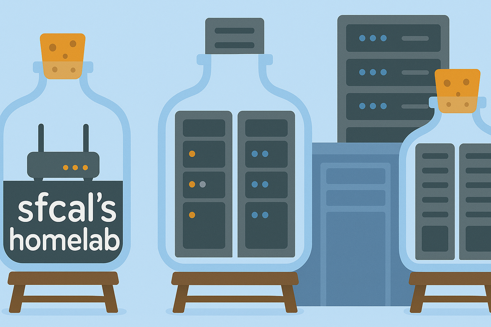

<div align="center">
  <picture>
    <source media="(prefers-color-scheme: dark)" srcset="docs/assets/banner.png">
    <source media="(prefers-color-scheme: light)" srcset="docs/assets/banner.png">
    
  </picture>

[Getting started] | [Documentation] | [Contributing]
</div>

[Getting Started]: #get-started
[Documentation]: https://homelab.samuel.computer
[Contributing]: CONTRIBUTING.md

# Homelab Infrastructure as Code

A complete infrastructure-as-code solution for managing a home Kubernetes cluster running on Proxmox VMs. This repository contains automation for the entire lifecycle - from VM template creation to Kubernetes application deployment.

## Multi-Environment Support

This repository supports multiple environments with location-based naming:

- **WIL**: Development/testing environment
- **NYC**: Production environment

Each environment can have its own configuration while sharing common base components.

## Deployment - Zero to Hero

There are 6 steps to fully deploy this homelab from scratch.

<details>
<summary>📋 Step 0: Prerequisites</summary>

Before starting, ensure you have the following:

#### Software Requirements
- **Docker** and **Docker Compose**
- **Git**
- **SSH key pair** for VM access

#### Initial Setup
```bash
# Clone the repository
git clone https://github.com/sfcal/homelab.git
cd homelab

# Clone dotfiles (optional but recommended)
git clone https://github.com/sfcal/.home.git ~/.home

# Generate SSH keys if you don't have them
ssh-keygen -t ed25519 -C "your-email@example.com"
```

</details>

<details>
<summary>🐳 Step 1: Build Execution Environment</summary>

Create a containerized environment with all necessary tools:

```bash
# Build the homelab execution container
cd docker/exe
docker build -t homelab-exe .

# Create a convenient alias for running commands
alias homelab='docker run -it --rm \
  -v "$HOME/.ssh:/home/devops/.ssh" \
  -v "$HOME/.kube:/home/devops/.kube" \
  -v "$PWD:/workspace" \
  -v "$HOME/.home:/home/devops/.home" \
  -v "$HOME/.gitconfig:/home/devops/.gitconfig" \
  -e ENV=dev \
  homelab-exe'

# Test the environment
homelab terraform version
homelab ansible --version
homelab kubectl version --client
```

</details>

<details>
<summary>📦 Step 2: Create VM Templates with Packer</summary>

Generate Ubuntu VM templates for your infrastructure:

#### Configure Packer Variables

1. **Create credentials file:**
```bash
cd packer/environments/dev
cp credentials.prod.pkrvars.hcl.example credentials.dev.pkrvars.hcl

# Edit with your Proxmox details
vim credentials.dev.pkrvars.hcl
```

Example credentials configuration:
```hcl
proxmox_api_url = "https://nyc-pve-01.home.samuel.computer:8006/api2/json"
proxmox_api_token_id = "root@pam!packer"
proxmox_api_token_secret = "your-secret-token-here"
ssh_password = "your-vm-ssh-password"
```

2. **Review environment variables:**
```bash
# Check dev environment settings
cat environments/dev/variables.pkrvars.hcl

# Adjust network, storage, and node settings as needed
vim environments/dev/variables.pkrvars.hcl
```

#### Build Templates

```bash
cd packer

# Build base Ubuntu template
make build TEMPLATE=base ENV=dev

# Verify template creation in Proxmox
# The template will be named: ubuntu-server-dev-base
```

**Alternative: Build all templates**
```bash
# Build base, docker, and k8s templates
make all ENV=dev
```

</details>

<details>
<summary>🏗️ Step 3: Provision VMs with Terraform</summary>

Deploy your K3s cluster infrastructure:

#### Configure Terraform Variables

1. **Create terraform variables:**
```bash
cd terraform/environments/dev
cp terraform.tfvars.example terraform.tfvars

# Edit with your configuration
vim terraform.tfvars
```

Example terraform configuration:
```hcl
# Provider configuration
proxmox_api_url = "https://nyc-pve-01.home.samuel.computer:8006/api2/json"
proxmox_api_token_id = "root@pam!terraform"
proxmox_api_token_secret = "your-terraform-token"

# SSH configuration
ssh_public_key = "ssh-ed25519 AAAAC3NzaC1lZDI1NTE5AAAAIG... your-public-key"
```

#### Deploy Infrastructure

```bash
# Deploy the infrastructure
make deploy ENV=dev

# Or run manually:
cd terraform/environments/dev
terraform init
terraform plan
terraform apply
```

This will create:
- **3 Master nodes**: 10.1.20.51, 10.1.20.52, 10.1.20.53
- **2 Worker nodes**: 10.1.20.41, 10.1.20.42, 10.1.20.43

#### Verify Deployment
```bash
# Check created VMs
terraform output

# Test SSH connectivity
ssh sfcal@10.1.20.51
```

</details>

<details>
<summary>⚙️ Step 4: Deploy K3s with Ansible</summary>

Install and configure your Kubernetes cluster:

#### Configure Ansible Variables

1. **Review inventory:**
```bash
cd ansible
cat environments/dev/hosts.ini
```

2. **Configure cluster settings:**
```bash
# Review cluster configuration
cat environments/dev/group_vars/all.yml

# Key settings to verify:
# - apiserver_endpoint: 10.1.20.222
# - k3s_token: (change the default)
# - metal_lb_ip_range: 10.1.20.140-10.1.20.150
```

#### Deploy K3s Cluster

```bash
# Deploy the K3s cluster
make deploy-k3s ENV=dev

# Or run manually:
ansible-playbook -i environments/dev/hosts.ini playbooks/k3s/deploy.yml
```

#### Verify K3s Installation

```bash
# Copy kubeconfig (automatically generated)
cp kubeconfig ~/.kube/config

# Test cluster connectivity
kubectl get nodes
kubectl get pods -A

# Check cluster status
kubectl cluster-info
```

Expected output:
```
NAME           STATUS   ROLES                       AGE   VERSION
k3s-master-01  Ready    control-plane,etcd,master   5m    v1.30.2+k3s2
k3s-master-02  Ready    control-plane,etcd,master   4m    v1.30.2+k3s2
k3s-master-03  Ready    control-plane,etcd,master   3m    v1.30.2+k3s2
k3s-worker-01  Ready    <none>                      2m    v1.30.2+k3s2
k3s-worker-02  Ready    <none>                      1m    v1.30.2+k3s2
k3s-worker-03  Ready    <none>                      1m    v1.30.2+k3s2
```

</details>

<details>
<summary>☸️ Step 5: Bootstrap Kubernetes Infrastructure</summary>

Deploy core cluster components using GitOps:

#### Install Flux

```bash
# Install Flux CLI
curl -s https://fluxcd.io/install.sh | sudo bash

# Bootstrap Flux (replace with your repository)
flux bootstrap github \
  --owner=sfcal \
  --repository=homelab \
  --branch=main \
  --path=./kubernetes/cluster/dev \
  --personal
```

#### Verify Infrastructure Deployment

Wait for core components to deploy:

```bash
# Watch namespace creation
watch kubectl get namespaces

# Monitor infrastructure deployment
kubectl get kustomizations -n flux-system

# Check core services
kubectl get pods -n traefik
kubectl get pods -n cert-manager
kubectl get pods -n longhorn-system
kubectl get pods -n monitoring
```

#### Access Web Interfaces

Once deployed, access your services:

- **Traefik Dashboard**: https://traefik.local.samuelcalvert.com
- **Grafana**: https://grafana.local.samuelcalvert.com
- **Longhorn**: https://longhorn.local.samuelcalvert.com

</details>

<details>
<summary>🚀 Step 6: Deploy Applications</summary>

Your cluster is now ready for applications:

#### Example: Deploy nginx

```bash
# Applications are managed via GitOps
# Check the nginx example
kubectl get pods -n default
kubectl get ingress

# Access nginx
curl http://nginx.local.samuelcalvert.com
```

#### Add Your Own Applications

1. Create application manifests in `kubernetes/apps/dev/`
2. Add to kustomization.yaml
3. Commit and push - Flux will automatically deploy

</details>

## Repository Structure
```
homelab/
├── 🔄 ansible/             # K3s deployment automation
│   ├── environments/       # Dev (10.1.20.x) and Prod (10.1.10.x) configs
│   ├── playbooks/          # Cluster operations (deploy, reset)
│   └── roles/              # Component configurations
│
├── 🐳 docker-compose/      # Standalone services
│   ├── bind9/              # 🔍 DNS servers
│   ├── media-stack/        # 🎬 Plex, Sonarr, Radarr
│   └── monitoring-stack/   # 📊 Prometheus/Grafana
│
├── 📚 docs/                # Documentation
│
├── ☸️ kubernetes/          # GitOps configurations
│   ├── apps/               # 📱 Application deployments
│   ├── cluster/            # 🧩 Cluster configurations
│   └── infrastructure/     # 🏗️ Core components (Traefik, Cert-Manager, etc.)
│
├── 📦 packer/              # VM template creation
│   ├── environments/       # Environment variables
│   └── templates/          # Template definitions
│
├── 🏢 terraform/           # Infrastructure provisioning
│   ├── environments/       # Dev and Prod environments
│   └── modules/            # Reusable components
│
├── 📜 scripts/             # Automation scripts
└── 📋 Makefile             # Task automation
```

## Network Structure


## Related Projects

These projects have been an inspiration to my homelab

- [onedr0p/cluster-template](https://github.com/onedr0p/cluster-template) - _ template for deploying a Talos Kubernetes cluster including Flux for GitOps_
- [ChristianLempa/homelab](https://github.com/ChristianLempa/homelab) - _This is my entire homelab documentation files. Here you'll find notes, setups, and configurations for infrastructure, applications, networking, and more._
- [khuedoan/homelab](https://github.com/khuedoan/homelab) - _Fully automated homelab from empty disk to running services with a single command._
- [ricsanfre/pi-cluster](https://github.com/ricsanfre/pi-cluster) - _Pi Kubernetes Cluster. Homelab kubernetes cluster automated with Ansible and FluxCD_
- [techno-tim/k3s-ansible](https://github.com/techno-tim/k3s-ansible) - _The easiest way to bootstrap a self-hosted High Availability Kubernetes cluster. A fully automated HA k3s etcd install with kube-vip, MetalLB, and more. Build. Destroy. Repeat._

## Other Resources

- [Dotfiles](https://github.com/sfcal/.home) - My personal configuration files

## License

This project is licensed under the GPLv3 License - see the LICENSE file for details.