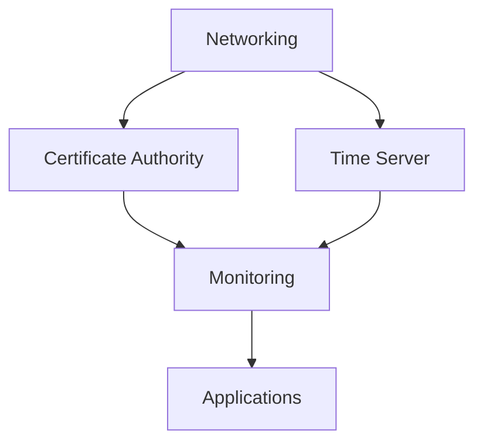

# Architecture

How the four pipeline stages connect to produce a running homelab.

## Pipeline


| Stage | Tool | What It Does |
|-------|------|-------------|
| 1. Templates | Packer | Builds cloud-init-enabled Ubuntu/Debian images on Proxmox |
| 2. Provisioning | Terraform | Clones templates into VMs with static IPs, CPU, memory, disk |
| 3. Configuration | Ansible | Installs packages, deploys Docker Compose services, configures networking |
| 4. Runtime | Docker Compose | Runs all application containers |

## Deployment Order

Infrastructure services have dependencies and must deploy in order:



```bash
task ansible:deploy-networking ENV=wil   # 1. DNS, Caddy, Tailscale
task ansible:deploy-ca ENV=wil           # 2. Step-CA
task ansible:deploy-ntp ENV=wil          # 3. Chrony
task ansible:deploy-monitoring ENV=wil   # 4. Prometheus, Grafana, Homepage
task ansible:deploy-media ENV=wil        # 5. Applications
```

!!! warning
    The **networking** VM must exist before all others — it runs BIND9, which is the nameserver for every other VM.

## Repository Structure

```
ansible/                    Playbooks, roles, per-environment inventories
terraform/                  VM provisioning with per-environment tfvars
packer/                     VM template definitions (Ubuntu, Debian)
docker/                     Docker execution environment
tui/                        Terminal UI for interactive management
.taskfiles/                 Modular Taskfile configs per tool
docs/                       This documentation site
Taskfile.yaml               Root task runner entry point
```

## Services

### Infrastructure

| Service | Host Group | IP (WIL) | Purpose |
|---------|-----------|----------|---------|
| BIND9, Caddy, Tailscale, DDNS | `infra_networking` | 10.2.20.53 | DNS, reverse proxy, VPN |
| Step-CA | `infra_ca` | 10.2.20.9 | Private certificate authority |
| Chrony | `infra_ntp` | 10.2.20.123 | NTP time synchronization |
| Prometheus, Grafana, Homepage | `infra_monitoring` | 10.2.20.30 | Metrics and dashboards |

### Applications

| Service | Host Group | Purpose |
|---------|-----------|---------|
| Media stack (Plex, *arr) | `app_mediastack` | Media management and streaming |
| Home Assistant | `app_homeassistant` | Home automation |
| Birdle | `app_birdle` | Bird identification game |
| Bookstack | `app_bookstack` | Wiki/documentation |
| CyberChef | `app_cyberchef` | Data encoding/decoding |
| IT-Tools | `app_ittools` | Developer utilities |
| Kasm | `app_kasm` | Browser-based desktops |
| MicroBin | `app_microbin` | Pastebin |
| OpenBooks | `app_openbooks` | Book search |
| Restreamer | `app_restreamer` | Video streaming relay |
| RomM | `app_romm` | ROM manager |
| Seafile | `app_seafile` | File sync and share |
| Stirling PDF | `app_stirlingpdf` | PDF tools |
| Website | `app_website` | Personal website |
| Games Server | `app_gamesserver` | Terraria server |
| ConvertX | `app_convertx` | File converter |

## Key Design Decisions

- **Docker Compose over Kubernetes** — simpler to operate, sufficient for homelab scale
- **Split-horizon DNS with BIND9** — internal clients resolve to internal IPs, external clients to public IP
- **SOPS + Age** — secrets encrypted at rest, committed to Git, decrypted at deploy time
- **Caddy** — automatic HTTPS with wildcard certificates via Cloudflare DNS-01
- **Task runner** — single CLI entry point for all Packer, Terraform, and Ansible operations
- **Data-driven app deployment** — most apps share a common `deploy-app.yml` playbook pattern, configured via `apps.yml`
