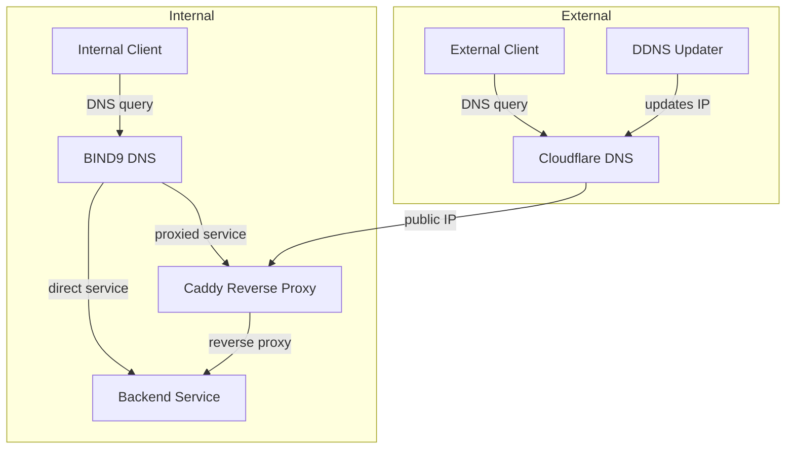

# Network Layout

The homelab runs a unified networking stack across multiple sites: internal DNS, a reverse proxy with automatic TLS, dynamic DNS for external access, and a VPN mesh connecting everything together.

!!! tip
    For detailed configuration and howto guides, see the [Networking infrastructure docs](../infrastructure/networking/index.md).

## Domains

| Domain | Environment | Purpose |
|--------|-------------|---------|
| `5am.video` | WIL (primary) | Media services (Plex, *arr stack) |
| `5am.cloud` | WIL (primary) | Top-level cloud services |
| `wil.5am.cloud` | WIL (primary) | WIL internal infrastructure (monitoring, apps) |
| `ext.5am.cloud` | WIL (primary) | External-facing services |
| `sfc.al` | WIL (primary) | Personal projects |
| `ldn.5am.cloud` | LDN (primary) | LDN internal infrastructure |

## How It Works

- **Internal clients** query [BIND9](../infrastructure/networking/dns.md) for service hostnames. Proxied services resolve to [Caddy](../infrastructure/networking/proxy.md), which terminates TLS and forwards to backends. Non-proxied services resolve directly to the backend.
- **External clients** resolve via Cloudflare DNS and reach Caddy over the public IP, kept current by DDNS.
- **Cross-site** communication runs over [Tailscale](../infrastructure/networking/tailscale.md) WireGuard tunnels. DNS zone transfers replicate zones between sites so each site can resolve the other's services.

## Key Concepts

- **Split-Horizon DNS** — internal and external clients get different answers for the same hostname. See [DNS Services](../infrastructure/networking/dns.md#split-horizon-dns).
- **Unified Service Definitions** — a single YAML entry per service drives both DNS records and reverse proxy configuration. See [Service Definition Reference](../infrastructure/networking/proxy.md#service-definition-reference).
- **Zone Transfers** — WIL and LDN replicate each other's DNS zones for cross-site resolution. See [Cross-Site Zone Transfers](../infrastructure/networking/dns.md#cross-site-zone-transfers).
- **Wildcard TLS** — Caddy obtains one wildcard certificate per domain via Cloudflare DNS-01 challenge. See [TLS Certificate Management](../infrastructure/networking/proxy.md#tls-certificate-management).
