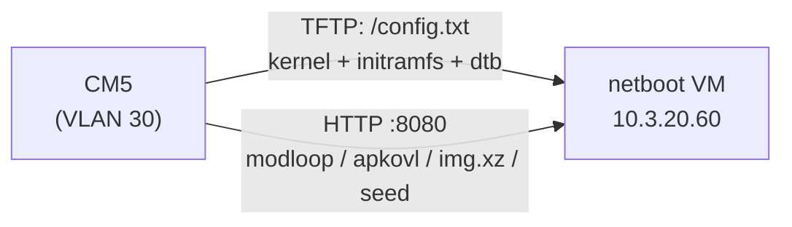

# Provision a CM5 over the Network

Netboot-provision (or re-image) a Raspberry Pi Compute Module 5 time-server node to a fresh Ubuntu install on its eMMC. Covered nodes and their identities live in `cm5_hosts` in `ansible/environments/ldn/group_vars/infra_netboot/vars.yml` (currently `time2`, `10.3.30.11`).

## How It Works

The Pi EEPROM bootloader is not UEFI — it never runs netboot.xyz or iPXE, and Ubuntu for Pi ships as a preinstalled image, not an installer. The netboot VM (`10.3.20.60`) therefore serves a parallel Pi boot tree next to the existing x86 flow:



1. The bootloader TFTP-fetches boot files from a directory named after the **last 8 hex digits** of the module serial (`89c03c1a/` for time2). Other VLAN 30 clients are unaffected — the Pi ignores the UniFi boot filename option, and x86 clients never request Pi paths.
2. It boots a tiny Alpine Linux flasher (kernel + initramfs over TFTP; module image and flash script over HTTP).
3. The flasher streams `ubuntu-26.04-preinstalled-server-arm64+raspi.img.xz` from the netboot VM straight onto `/dev/mmcblk0`, then writes the node's cloud-init seed (hostname, static IP, SSH keys) onto the `system-boot` FAT partition, and reboots into the fresh OS.

**Always armed, by design.** The per-serial payload is permanently served, but `BOOT_ORDER=0xf2461` tries eMMC → NVMe → USB → network, so a healthy node never netboots. Only a blank or unbootable module falls through — and then it provisions itself, zero-touch. The trade-off is deliberate: an eMMC that stops booting gets *reflashed*, not debugged. To exempt one node without removing its payload, drop a file named `disabled` in `/opt/netbootxyz/assets/cm5/<full-serial>/` on the netboot VM.

**Interrupted flashes are safe.** The flasher zeroes the partition table first and writes it back **last**, so a power cut mid-flash always leaves the eMMC non-bootable — the boot loop re-enters the flasher and retries.

## One-time EEPROM prerequisites (per CM5)

The Pi bootloader is not reliably served by the UDM's DHCP boot option, so the TFTP server is pinned in EEPROM. On the node (or via the ptp-experiments EEPROM provisioning):

```bash
sudo rpi-eeprom-config --edit
```

Add alongside the existing `BOOT_ORDER`:

```
TFTP_IP=10.3.20.60
TFTP_FILE_TIMEOUT=60000
BOOT_WATCHDOG_TIMEOUT=300
```

Keep `NETWORK` (nibble `2`) in `BOOT_ORDER` — it is the terminal fallback this whole flow depends on. Verify after reboot with `vcgencmd bootloader_config`.

## Provision a blank module

Nothing to do: publish its identity and deploy, then plug it in. It falls through to network boot and flashes itself.

1. Add the module to `cm5_hosts` (full 16-hex serial from `cat /proc/device-tree/serial-number`, or the sticker) with hostname/IP/gateway/nameserver.
2. `task ansible:deploy-netboot ENV=ldn` (first run downloads the ~90 MB Alpine tarball and ~1.4 GB Ubuntu image onto the netboot VM).
3. Power the module on VLAN 30. Flash takes roughly 5–10 minutes; it comes up on its static IP with SSH keys installed.

## Re-image a working node (manual, deliberate)

A healthy node never netboots on its own. Trigger it from the node — preferred (one-shot, auto-clearing, falls back to the old OS if the flasher fails to load):

```bash
ssh sfcal@10.3.30.11 'sudo vcmailbox 0x0003808b 4 4 0xf12 && sudo reboot'
```

`0xf12` = try NETWORK first, then eMMC, this boot only (`set_reboot_order`, EEPROM ≥ 2025-01-14). Fallback for older firmware — on Pi 5-family, `config.txt` presence *is* the bootability test:

```bash
ssh sfcal@10.3.30.11 'sudo mv /boot/firmware/config.txt /boot/firmware/config.txt.disarmed && sudo reboot'
```

(The flasher restores a fresh `config.txt` by reflashing; there is no undo short of moving the file back before rebooting.)

After the reflash, re-run the ptp-experiments Ansible — the flash resets the tryboot A/B state (`autoboot.txt`, `current/`, `new/`) to the stock single-boot layout.

## Troubleshooting

- **Module loops without flashing** — `tcpdump -i any port 69` on the netboot VM; expect a request for `<short-serial>/config.txt`. No request: check `TFTP_IP` in EEPROM (`vcgencmd bootloader_config`) and that the NIC is the built-in ethernet (the bootloader netboots only on that). Request for the wrong dir: `cm5_hosts` serial doesn't match — the TFTP dir is the *last 8* hex digits.
- **Alpine boots but nothing happens** — check `http://10.3.20.60:8080/cm5/<full-serial>/apkovl.tar.gz` and `user-data` return 200, and that no `disabled` file exists for the serial. Console messages are prefixed `cm5-flash:`.
- **Flash is slow** — TFTP (kernel+initramfs, ~28 MB) is lockstep and slow by protocol; the big transfers ride HTTP. Total ~5–10 min is normal.
- **Ubuntu image URL 404s** — point releases displace the filename on cdimage.ubuntu.com (26.04.1 ~Aug 2026); bump `cm5_ubuntu_image_url`/`cm5_ubuntu_image_sha256`, or fetch the GA image from `old-releases.ubuntu.com`. The cached copy on the netboot VM keeps working regardless.
- **Never** place a `config.txt` or `pieeprom.*` at the TFTP root (`/opt/netbootxyz/config/menus/`) — the former would hijack every Pi on the VLAN, the latter would trigger silent EEPROM self-update on netbooting Pis.
