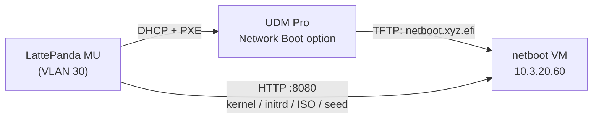

# Re-image the Time Server

Reset the PTP time server (LattePanda MU, `10.3.30.64`, LDN VLAN 30) to a fresh Ubuntu install over the network. The loop is: PXE boot the MU → confirm once at the console → wait for the unattended install → the MU reboots into fresh Ubuntu → re-run the ptp-experiments Ansible.

The MU is a physical UEFI x86 SBC managed by the separate `ptp-experiments` repo — the homelab provides only the netboot service that lays down the base OS. (The Raspberry Pi CM5 time-server nodes use a different mechanism on the same netboot VM — see [Provision a CM5](provision-cm5.md).)

## How It Works



The UDM Pro's VLAN 30 DHCP scope points PXE clients at the netboot VM running [netboot.xyz](https://netboot.xyz) (see [UniFi Gateway — Network Boot](../infrastructure/networking/unifi.md#network-boot-pxe)).

The netboot.xyz bootloader chains `MAC-${mac:hexhyp}.ipxe` from the TFTP root before falling back to `menu.ipxe`, so a per-MAC script scoped to the MU's PXE NIC boots it straight into the installer with no menu interaction — every other VLAN 30 client still gets the standard menu. That script omits the `autoinstall` kernel argument deliberately, so the installer asks for exactly one confirmation before wiping the disk, then runs unattended.

The per-MAC script is **always staged** — there is no arm/disarm step, mirroring the CM5 flasher. A healthy node boots from its local disk and never reaches PXE; it lands in the installer only when local boot fails or PXE is deliberately chosen from the firmware boot menu. When the install finishes the node reboots straight into the fresh OS (a node that still cannot boot locally just returns to the installer's confirmation prompt).

!!! warning "There is no in-iPXE abort"
    A PXE boot of a listed MAC loads the installer **immediately** — there is no ESC/countdown abort. The only safety gate is subiquity's single disk-wipe confirmation at the console: to abort, decline that prompt or power the MU off before confirming. Every other VLAN 30 client still gets the standard netboot.xyz menu, which times out to local disk in ~10s.

## Pre-flight

1. **Verify the Ubuntu release on the MU.** The DKMS drivers in ptp-experiments (`igc-ppsfix`, `ptp-ocp-gnsspps`) are built against the MU's current kernel series, so the re-install must use the same release:

    ```bash
    ssh sfcal@10.3.30.64 'lsb_release -sr; uname -r'
    ```

    (Console fallback if SSH is down.)

2. **Pin the release** in `ansible/environments/ldn/group_vars/infra_netboot/vars.yml`: set `netboot_ubuntu_iso_url` and `netboot_ubuntu_iso_sha256` (from the `SHA256SUMS` file next to the ISO; superseded interim releases move to `old-releases.ubuntu.com` — point the URL there for the exact base image). Then redeploy:

    ```bash
    task ansible:deploy-netboot ENV=ldn
    ```

    The first run downloads the ~3 GB ISO onto the netboot VM.

3. **Confirm the PXE MAC.** Each time server is an entry in `timeserver_hosts` in the netboot vars, keyed by its PXE NIC's MAC (lowercase, `-`-separated). Check the MU's key matches the NIC that PXE-boots — on the MU, `ip a` shows the NIC holding `10.3.30.64` (currently `enp1s0`), converting `:` separators to `-`. The installed OS pins the entry's `ip` statically via this MAC, so the address is deterministic and no longer depends on the UniFi DHCP reservation — though keeping the reservation as a backstop does no harm.

4. **Nothing to back up** — the grandmaster's state is fully rebuilt by ptp-experiments. Note that Grafana/Prometheus history under `/opt/monitoring` on the MU is lost on re-image.

## Re-image

1. PXE boot the MU: reboot it and pick the network boot entry from the firmware boot menu. (A broken MU that cannot boot its disk lands there on its own — that is the self-provisioning path.)
2. The installer loads **immediately** — there is no ESC/countdown. To abort, power off before the next step.
3. The installer asks a single confirmation before touching the disk — confirm at the console. (This is the only safety gate.)
4. Wait for the unattended install to finish. The MU reboots into the fresh install off local disk — coming up as `sfcal` with SSH keys installed and the static address `10.3.30.64`.

## Restore

From the `ptp-experiments` repo:

```bash
ansible-playbook -i hosts.ini deploy.yml -l ptp_server
```

The two DKMS drivers only load after a reboot (the playbook flags `/run/reboot-required` rather than rebooting) — reboot when prompted and re-run if needed.

## Troubleshooting

- **iPXE times out fetching the boot file** — check the VLAN 30 Network Boot option and that UDP 69 / TCP 8080 reach `10.3.20.60` (see the firewall notes in the [UniFi doc](../infrastructure/networking/unifi.md#network-boot-pxe)).
- **Installer ignores the seed / runs fully interactive** — first check the nginx access log on the netboot VM for a second full-ISO fetch with user-agent `Cloud-Init`: cloud-init treats casper's `url=` kernel argument as a cloud-config URL and re-downloads the whole ISO into RAM before reading the seed. The `cloud-config-url=/dev/null` argument in `timeserver-reimage.ipxe.j2` suppresses this — if it's missing, that's the cause. Otherwise verify `http://10.3.20.60:8080/timeserver/<mac>/user-data`, `meta-data`, `network-config`, and `vendor-data` all return 200 (the `<mac>` directory is the host's `timeserver_hosts` key), and diagnose from the installer console: `Ctrl+Alt+F2`, then `cloud-init status --long`, `ls /autoinstall.yaml`, and `dmesg | grep -i oom`. Any edit to `timeserver-reimage.ipxe.j2` deploys on the next `task ansible:deploy-netboot ENV=ldn` run.
- **MU drops to the netboot.xyz menu instead of the installer** — its `timeserver_hosts` key does not match the NIC that actually PXE-booted, or the netboot service has not been redeployed since the entry was added. Confirm the file exists as `MAC-<mac>.ipxe` in `/opt/netbootxyz/config/menus/` on the netboot VM.
- **Re-imaged MU comes up on the wrong IP** — the installed OS pins the entry's `ip` (`10.3.30.64`) by the PXE NIC's MAC. If it lands elsewhere, the booting NIC's MAC does not match the host's `timeserver_hosts` key.
- **Kernel boots then stalls loading the ISO** — the `url=` boot loads the whole ISO into RAM; the client needs more RAM than the ISO size.
