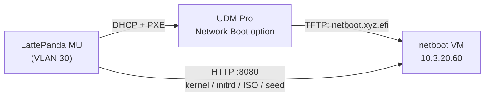

# Re-image the Time Server

Reset the PTP time server (LattePanda MU, `10.3.30.64`, LDN VLAN 30) to a fresh Ubuntu install over the network. The loop is: PXE boot → pick the menu entry → confirm once at the console → wait for the unattended install → re-run the ptp-experiments Ansible.

The MU is a physical UEFI x86 SBC managed by the separate `ptp-experiments` repo — the homelab provides only the netboot service that lays down the base OS.

## How It Works



The UDM Pro's VLAN 30 DHCP scope points PXE clients at the netboot VM running [netboot.xyz](https://netboot.xyz) (see [UniFi Gateway — Network Boot](../infrastructure/networking/unifi.md#network-boot-pxe)). The custom menu entry boots the Ubuntu live-server kernel with a NoCloud autoinstall seed but **without** the `autoinstall` kernel argument, so the installer asks for exactly one confirmation before wiping the disk, then runs unattended.

## Pre-flight

1. **Verify the Ubuntu release on the MU.** The DKMS drivers in ptp-experiments (`igc-ppsfix`, `ptp-ocp-gnsspps`) are built against the MU's current kernel series, so the re-install must use the same release:

    ```bash
    ssh sfcal@10.3.30.64 'lsb_release -sr; uname -r'
    ```

    (Console fallback if SSH is down.)

2. **Pin the release** in `ansible/environments/ldn/group_vars/infra_netboot/vars.yml`: set `netboot_ubuntu_version` and `netboot_ubuntu_iso_sha256` (from `https://releases.ubuntu.com/<version>/SHA256SUMS`; superseded interim releases move to `old-releases.ubuntu.com` — update `netboot_ubuntu_iso_url` accordingly). Then redeploy:

    ```bash
    task ansible:deploy-netboot ENV=ldn
    ```

    The first run downloads the ~3 GB ISO onto the netboot VM.

3. **Confirm the DHCP reservation** mapping the MU's NIC MAC to `10.3.30.64` in the UniFi client list (see [UniFi Gateway — DHCP Reservation](../infrastructure/networking/unifi.md#dhcp-reservation)).

4. **Nothing to back up** — the grandmaster's state is fully rebuilt by ptp-experiments. Note that Grafana/Prometheus history under `/opt/monitoring` on the MU is lost on re-image.

## Re-image

1. Reboot the MU and enter the firmware boot menu; select **UEFI PXE IPv4** boot.
2. The netboot.xyz menu loads → **Custom user menu** → **Re-image PTP time server**.
3. The installer boots and asks a single confirmation before touching the disk — confirm at the console.
4. Wait for the unattended install to finish. The MU reboots into fresh Ubuntu with user `sfcal`, SSH keys installed, and DHCP networking (landing on `10.3.30.64` via the reservation).

## Restore

From the `ptp-experiments` repo:

```bash
ansible-playbook -i hosts.ini deploy.yml -l ptp_server
```

The two DKMS drivers only load after a reboot (the playbook flags `/run/reboot-required` rather than rebooting) — reboot when prompted and re-run if needed.

## Troubleshooting

- **iPXE times out fetching the boot file** — check the VLAN 30 Network Boot option and that UDP 69 / TCP 8080 reach `10.3.20.60` (see the firewall notes in the [UniFi doc](../infrastructure/networking/unifi.md#network-boot-pxe)).
- **Installer ignores the seed / runs fully interactive** — verify `http://10.3.20.60:8080/timeserver/seed/user-data` and `meta-data` both return 200; on very new cloud-init, change `ds=nocloud-net` to `ds=nocloud` in `custom.ipxe.j2`.
- **Kernel boots then stalls loading the ISO** — the `url=` boot loads the whole ISO into RAM; the client needs more RAM than the ISO size.
