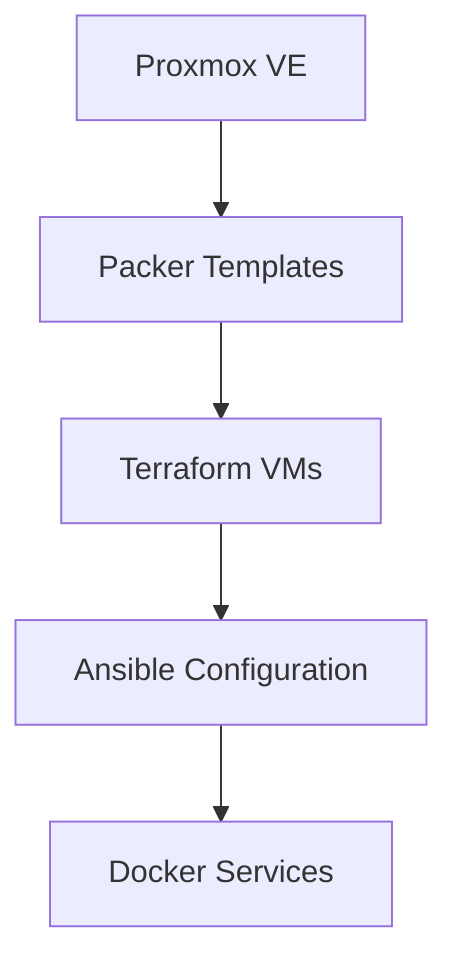

# Homelab Infrastructure as Code

A complete infrastructure-as-code solution for managing a homelab running on Proxmox VMs. It automates the entire lifecycle from VM template creation to service deployment.

---

## What is this project?

This repository provisions and configures a full homelab environment using modern DevOps tooling:

- **VM Template Creation** with Packer
- **Infrastructure Provisioning** with Terraform
- **Configuration Management** with Ansible
- **Service Deployment** with Docker Compose

Everything is version-controlled, encrypted with SOPS, and supports multiple environments.

## Quick Links

- [Quick Start](getting-started/quick-start.md) - Get up and running
- [Prerequisites](getting-started/prerequisites.md) - What you need before starting
- [Architecture](concepts/architecture.md) - How everything fits together
- [FAQ](reference/faq.md) - Frequently asked questions

## Architecture Overview

## Technology Stack

| Component | Technology | Purpose |
|-----------|------------|---------|
| Virtualization | Proxmox VE | VM hosting platform |
| VM Templates | Packer | Automated template creation |
| Infrastructure | Terraform | VM provisioning |
| Configuration | Ansible | Service deployment and orchestration |
| Containers | Docker Compose | Application containerization |
| Reverse Proxy | Caddy | HTTPS and routing |
| DNS | BIND9 | Internal split-horizon DNS |
| Monitoring | Prometheus + Grafana | Metrics and visualization |
| Secrets | SOPS + Age | Encrypted configuration |
| Automation | Task | Command orchestration |

## Services

| Service | Domain | Description |
|---------|--------|-------------|
| Plex + *arr stack | `5am.video` | Media management and streaming |
| Prometheus + Grafana | `wil.5am.cloud` | Infrastructure monitoring |
| Homepage | `wil.5am.cloud` | Dashboard |
| Personal Website | `sfc.al` | Personal projects |
| Birdle | `sfc.al` | Bird identification game |
| Terraria | - | Game server |

## Getting Help

- Browse the [full documentation](getting-started/quick-start.md)
- Report issues on [GitHub](https://github.com/sfcal/homelab/issues)
