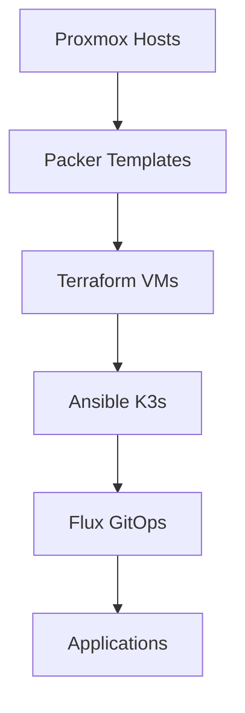

# Homelab Infrastructure as Code

Welcome to the Homelab Infrastructure as Code documentation! This guide will help you deploy and manage a complete Kubernetes homelab environment using modern DevOps practices.

## What is this project?

This repository contains a complete infrastructure-as-code solution for managing a home Kubernetes cluster running on Proxmox VMs. It automates the entire lifecycle:

- **VM Template Creation** with Packer
- **Infrastructure Provisioning** with Terraform  
- **Kubernetes Deployment** with Ansible
- **Application Management** with Flux GitOps

## Quick Links

- [Quick Start Guide](getting-started/quick-start.md) - Get up and running in minutes
- [Prerequisites](getting-started/prerequisites.md) - What you need before starting
- [Network Layout](concepts/network-layout.md) - Understanding the network architecture
- [FAQ](reference/faq.md) - Frequently asked questions

## Key Features

- 🚀 **Fully Automated** - From bare metal to running services
- 🏗️ **Infrastructure as Code** - Everything is version controlled
- 🔄 **GitOps Ready** - Flux manages your Kubernetes applications
- 📦 **Modular Design** - Use only what you need
- 🌍 **Multi-Environment** - Separate dev and prod configurations

## Architecture Overview

## Technology Stack

| Component | Technology | Purpose |
|-----------|------------|---------|
| Virtualization | Proxmox VE | VM hosting platform |
| VM Templates | Packer | Automated template creation |
| Infrastructure | Terraform | VM provisioning |
| Configuration | Ansible | K3s deployment |
| Kubernetes | K3s | Lightweight Kubernetes |
| GitOps | FluxCD | Application deployment |
| Storage | Longhorn | Distributed storage |
| Ingress | Traefik | Reverse proxy |
| Monitoring | Prometheus + Grafana | Metrics and visualization |

## Getting Help

- 📖 Browse the [full documentation](getting-started/quick-start.md)
- 🐛 Report issues on [GitHub](https://github.com/sfcal/homelab/issues)
- 💬 Join the discussion on [GitHub Discussions](https://github.com/sfcal/homelab/discussions)