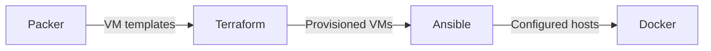

# Homelab Infrastructure as Code

An infrastructure-as-code homelab on Proxmox. Automates the full lifecycle from VM template creation to service deployment across multiple environments.

```mermaid
graph LR
    A[Packer] -->|VM templates| B[Terraform]
    B -->|Provisioned VMs| C[Ansible]
    C -->|Configured hosts| D[Docker]
```

## Technology Stack

| Component | Technology | Purpose |
|-----------|------------|---------|
| Virtualization | Proxmox VE | VM hosting platform |
| VM Templates | Packer | Automated template creation |
| Infrastructure | Terraform | VM provisioning |
| Configuration | Ansible | Service deployment and orchestration |
| Containers | Docker Compose | Application containerization |
| Reverse Proxy | Caddy | Automatic HTTPS and routing |
| DNS | BIND9 | Internal split-horizon DNS |
| Monitoring | Prometheus + Grafana | Metrics and dashboards |
| Secrets | SOPS + Age | Encrypted configuration |
| Task Runner | Task | Unified CLI for all operations |

## Quick Links

| | |
|---|---|
| [Prerequisites](getting-started/index.md) | What you need before deploying |
| [Quick Start](getting-started/quick-start.md) | Deploy the homelab from scratch |
| [Architecture](concepts/architecture.md) | How the pipeline stages connect |
| [Task Commands](reference/tasks.md) | Full command reference |
