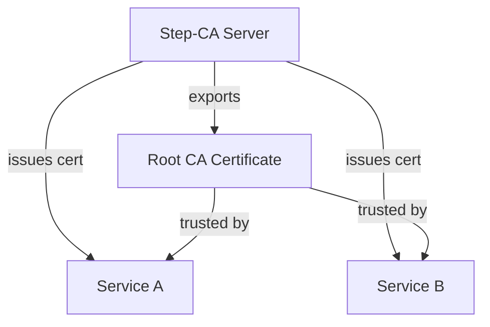

# Certificate Authority (Step-CA)

Step-CA provides a private certificate authority for issuing internal TLS certificates. It runs as a Docker container on a dedicated VM in each environment, enabling services to communicate over HTTPS without relying on public CAs.

!!! note "Deployment order"
    Step-CA deploys after [Networking](../networking/index.md) and before NTP, monitoring, and applications.

## Architecture



Step-CA initializes on first run with a root CA certificate and an admin provisioner. Services request certificates via the ACME protocol or the `step` CLI. The root CA certificate is exported and can be distributed to clients for trust.

## File Locations

| File | Purpose |
|------|---------|
| `playbooks/infrastructure/ca/deploy.yml` | Main playbook |
| `playbooks/infrastructure/ca/tasks/step-ca.yml` | Installation and configuration task |
| `playbooks/infrastructure/ca/templates/compose.yaml.j2` | Docker Compose service definition |
| `playbooks/infrastructure/ca/handlers/main.yml` | Container lifecycle handlers |
| `environments/<env>/group_vars/infra_ca/vars.yml` | Per-environment CA variables |
| `environments/<env>/group_vars/infra_ca/secrets.sops.yml` | Encrypted provisioner password |

## Hosts

| Environment | IP | FQDN |
|-------------|----|------|
| WIL | `10.2.20.9` | `ca.wil.5am.cloud` |
| LDN | `10.3.20.9` | `ca.ldn.5am.cloud` |

## Deployment

```bash
task ansible:deploy-ca ENV=wil
```

The task file performs these steps in order:

1. Creates directory structure at `/opt/step-ca/` and `/opt/step-ca/data/`
2. Deploys the provisioner password file (mode `0600`)
3. Deploys `compose.yaml` from template
4. Starts the Step-CA container
5. Waits 10 seconds for initialization
6. Runs a health check against `https://127.0.0.1:9000/health`
7. Configures certificate duration claims in `ca.json` via `jq`
8. Exports the root CA certificate to `/opt/step-ca/root_ca.crt`
9. Displays status output

<small>**Source:** [`ansible/playbooks/infrastructure/ca/tasks/step-ca.yml`](https://github.com/sfcal/homelab/blob/main/ansible/playbooks/infrastructure/ca/tasks/step-ca.yml)</small>

## Docker Compose

The container runs `smallstep/step-ca` with the following configuration:

- **Port:** `9000` (HTTPS API)
- **Volumes:** `./data` for CA state, `./password.txt` mounted read-only
- **Restart policy:** `unless-stopped`
- **Initialization:** handled via `DOCKER_STEPCA_INIT_*` environment variables on first run

<small>**Source:** [`ansible/playbooks/infrastructure/ca/templates/compose.yaml.j2`](https://github.com/sfcal/homelab/blob/main/ansible/playbooks/infrastructure/ca/templates/compose.yaml.j2)</small>

## Configuration Reference

All variables are set in `ansible/environments/<env>/group_vars/infra_ca/vars.yml`.

| Parameter | Type | Description | Default |
|-----------|------|-------------|---------|
| `step_ca_version` | `string` | Docker image tag for Step-CA | (per-env) |
| `step_ca_port` | `integer` | HTTPS API listen port | `9000` |
| `step_ca_name` | `string` | CA display name, appears in issued certificates | (per-env) |
| `step_ca_dns_names` | `string` | Comma-separated DNS names and IPs for the CA's TLS cert | (per-env) |
| `step_ca_provisioner_name` | `string` | Admin provisioner name | `"admin"` |
| `step_ca_init_ssh` | `string` | Initialize SSH certificate support | `"false"` |
| `step_ca_uid` | `string` | Container file ownership UID | `"1000"` |
| `step_ca_gid` | `string` | Container file ownership GID | `"1000"` |
| `step_ca_default_cert_duration` | `string` | Default certificate validity period | `"720h"` |
| `step_ca_max_cert_duration` | `string` | Maximum certificate validity period | `"17520h"` |
| `step_ca_provisioner_password` | `string` | Admin provisioner password (SOPS-encrypted) | (required) |

<small>**Sources:** `ansible/environments/<env>/group_vars/infra_ca/vars.yml` · `ansible/environments/<env>/group_vars/infra_ca/secrets.sops.yml`</small>

## Common Tasks

### Verify CA health

```bash
task ca:health ENV=wil
```

Or manually:

```bash
curl -k https://ca.wil.5am.cloud:9000/health
```

### Export the root CA certificate

The root certificate is automatically exported during deployment to `/opt/step-ca/root_ca.crt`. To retrieve it:

```bash
ssh sfcal@10.2.20.9 cat /opt/step-ca/root_ca.crt
```

### Change certificate duration

1. Edit `ansible/environments/<env>/group_vars/infra_ca/vars.yml`:

    ```yaml
    step_ca_default_cert_duration: "2160h"   # 90 days
    step_ca_max_cert_duration: "17520h"      # 2 years
    ```

2. Deploy:

    ```bash
    task ansible:deploy-ca ENV=wil
    ```

The task applies duration changes to `ca.json` via `jq` on each run.

### Restart the CA

The playbook handlers support lifecycle management:

```bash
# Full redeploy (will restart automatically if config changes)
task ansible:deploy-ca ENV=wil
```
