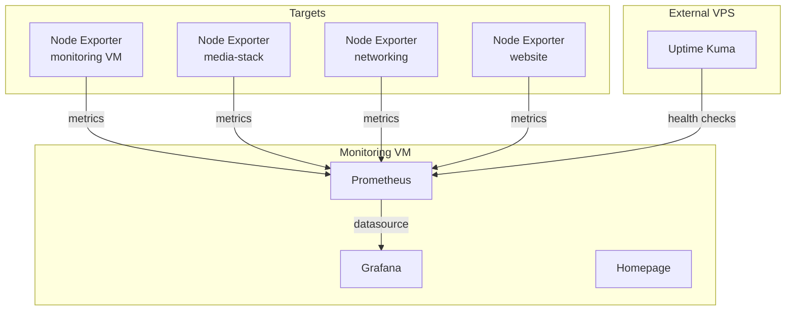

# Monitoring

The monitoring stack provides metrics collection, visualization, a service dashboard, and external uptime monitoring. It runs as Docker containers on a dedicated VM in each environment.

!!! note "Deployment order"
    Monitoring deploys after [Networking](../networking/index.md), [Step-CA](../ca/index.md), and [NTP](../ntp/index.md). It is the last infrastructure service to deploy before applications.

## Architecture



- **Prometheus** scrapes node exporters across all VMs for system metrics
- **Grafana** visualizes metrics from Prometheus with dashboards
- **Homepage** provides a service dashboard with status widgets and quick links
- **Uptime Kuma** runs on an external VPS for independent uptime monitoring via [Tailscale](../networking/tailscale.md)

## Components

| Component | Image | Port | Purpose |
|-----------|-------|------|---------|
| Prometheus | `prom/prometheus` | 9090 | Metrics collection and storage |
| Grafana | `grafana/grafana` | 3000 | Metrics visualization |
| Homepage | `ghcr.io/gethomepage/homepage` | 3002 | Service dashboard |
| Uptime Kuma | `louislam/uptime-kuma` | 3001 | External uptime monitoring |

## Hosts

| Environment | VM | IP |
|-------------|----|----|
| WIL | Monitoring | `10.2.20.30` |
| LDN | Monitoring | `10.3.20.30` |
| External | VPS | `178.156.190.134` |

## File Locations

### Monitoring Stack

| File | Purpose |
|------|---------|
| `playbooks/infrastructure/monitoring/deploy.yml` | Main playbook |
| `playbooks/infrastructure/monitoring/tasks/monitoring-stack.yml` | Deployment task |
| `playbooks/infrastructure/monitoring/templates/compose.yaml.j2` | Docker Compose definition |
| `playbooks/infrastructure/monitoring/templates/prometheus.yml.j2` | Prometheus scrape config |
| `playbooks/infrastructure/monitoring/templates/grafana-datasources.yml.j2` | Grafana datasource provisioning |
| `playbooks/infrastructure/monitoring/templates/services.yaml.j2` | Homepage services dashboard |
| `playbooks/infrastructure/monitoring/templates/bookmarks.yaml.j2` | Homepage bookmarks |
| `playbooks/infrastructure/monitoring/templates/settings.yaml.j2` | Homepage theme and layout |
| `playbooks/infrastructure/monitoring/templates/widgets.yaml.j2` | Homepage widgets |
| `playbooks/infrastructure/monitoring/handlers/main.yml` | Container lifecycle handlers |
| `environments/<env>/group_vars/infra_monitoring/` | Per-environment variables |

### External Monitoring

| File | Purpose |
|------|---------|
| `playbooks/infrastructure/external-monitoring/deploy.yml` | Main playbook |
| `playbooks/infrastructure/external-monitoring/templates/compose.yaml.j2` | Docker Compose definition |
| `environments/external/group_vars/infra_externalmonitoring/vars.yml` | External monitoring variables |

## Deployment

```bash
# Deploy internal monitoring stack
task ansible:deploy-monitoring ENV=wil

# Deploy external uptime monitoring
task ansible:deploy-external-monitoring ENV=external
```

### Monitoring Stack Deployment

The task file:

1. Creates directory structure under `/opt/monitoring/`
2. Sets ownership to `monitoring_uid:monitoring_gid`
3. Deploys Prometheus configuration
4. Deploys Grafana datasource provisioning
5. Deploys Homepage configuration files (services, bookmarks, settings, widgets)
6. Deploys Docker Compose file
7. Starts all containers

### External Monitoring Deployment

The external monitoring playbook:

1. Runs the `common` role (timezone, apt cache)
2. Installs and configures [Tailscale](../networking/tailscale.md) as a client (to reach internal services)
3. Deploys Uptime Kuma via the `docker_service` role

---

## Prometheus

Prometheus scrapes metrics from node exporters running on infrastructure and application VMs.

### Scrape Configuration

The `prometheus.yml.j2` template generates the scrape config:

```yaml
global:
  scrape_interval: 15s
  evaluation_interval: 15s

scrape_configs:
  - job_name: 'prometheus'
    static_configs:
      - targets: ['localhost:9090']

  - job_name: 'node-exporter'
    static_configs:
      - targets:
          - 'localhost:9100'
          - '10.2.0.5:9100'
          # ... all node targets
```

### Container Configuration

- **Memory:** 2GB limit, 1GB reservation
- **Retention:** configurable via `prometheus_retention`
- **Storage:** persistent volume at `/prometheus`
- **User:** runs as `monitoring_uid:monitoring_gid`

<small>**Source:** [`ansible/playbooks/infrastructure/monitoring/templates/prometheus.yml.j2`](https://github.com/sfcal/homelab/blob/main/ansible/playbooks/infrastructure/monitoring/templates/prometheus.yml.j2)</small>

### Configuration Reference

| Parameter | Type | Description | Default |
|-----------|------|-------------|---------|
| `prometheus_version` | `string` | Docker image tag for Prometheus | (per-env) |
| `prometheus_retention` | `string` | Metrics data retention period | `"30d"` |
| `prometheus_node_targets` | `list[string]` | Node exporter endpoints to scrape (`host:port`) | (per-env) |
| `node_exporter_version` | `string` | Docker image tag for Node Exporter sidecar | (per-env) |

<small>**Sources:** `ansible/environments/<env>/group_vars/infra_monitoring/prometheus.yml` · `ansible/environments/<env>/group_vars/infra_monitoring/containers.yml`</small>

---

## Grafana

Grafana connects to Prometheus as its default datasource and provides metric visualization dashboards.

### Datasource Provisioning

Grafana auto-provisions a Prometheus datasource on startup via `grafana-datasources.yml.j2`:

```yaml
apiVersion: 1
datasources:
  - name: Prometheus
    type: prometheus
    access: proxy
    url: http://prometheus:9090
    isDefault: true
    editable: true
```

### Container Configuration

- **Memory:** 2GB limit, 1GB reservation
- **Depends on:** Prometheus
- **Provisioning:** mounted read-only at `/etc/grafana/provisioning`
- **Sign-up:** disabled (`GF_USERS_ALLOW_SIGN_UP=false`)

### Configuration Reference

| Parameter | Type | Description | Default |
|-----------|------|-------------|---------|
| `grafana_version` | `string` | Docker image tag for Grafana | (per-env) |
| `grafana_admin_user` | `string` | Admin username for the web UI | `"admin"` |
| `grafana_admin_password` | `string` | Admin password (SOPS-encrypted) | (required) |
| `grafana_url` | `string` | Root URL for links in notifications and dashboards | (per-env) |

<small>**Sources:** `ansible/environments/<env>/group_vars/infra_monitoring/grafana.yml` · [`ansible/playbooks/infrastructure/monitoring/templates/grafana-datasources.yml.j2`](https://github.com/sfcal/homelab/blob/main/ansible/playbooks/infrastructure/monitoring/templates/grafana-datasources.yml.j2)</small>

---

## Homepage

Homepage provides a service dashboard with status widgets, service health indicators, and quick links to all homelab services.

### Container Configuration

- **Memory:** 512MB limit, 256MB reservation
- **Docker socket:** mounted read-only for container status widgets
- **Environment:** receives API keys for service widgets (Sonarr, Radarr, Bazarr, Prowlarr, SABnzbd, Plex)

### Configuration Reference

| Parameter | Type | Description | Default |
|-----------|------|-------------|---------|
| `homepage_version` | `string` | Docker image tag for Homepage | `"latest"` |
| `homepage_allowed_hosts` | `string` | Comma-separated hostnames Homepage responds to | (per-env) |

### Dashboard Configuration

Homepage is configured via four YAML template files:

| Template | Purpose |
|----------|---------|
| `services.yaml.j2` | Service cards with status widgets (media, monitoring, node exporters) |
| `bookmarks.yaml.j2` | Quick links (TrueNAS, Proxmox) |
| `settings.yaml.j2` | Theme (dark, slate), layout (row style, column counts) |
| `widgets.yaml.j2` | Global widgets (search bar, datetime) |

<small>**Sources:** `ansible/environments/<env>/group_vars/infra_monitoring/containers.yml` · [`ansible/playbooks/infrastructure/monitoring/templates/services.yaml.j2`](https://github.com/sfcal/homelab/blob/main/ansible/playbooks/infrastructure/monitoring/templates/services.yaml.j2)</small>

---

## External Monitoring (Uptime Kuma)

Uptime Kuma runs on an external VPS to provide independent uptime monitoring. It connects to the internal network via Tailscale to monitor services that are not publicly exposed.

### Configuration Reference

| Parameter | Type | Description | Default |
|-----------|------|-------------|---------|
| `uptime_kuma_version` | `string` | Docker image tag for Uptime Kuma | (per-env) |
| `external_monitoring_uptime_kuma_listen` | `string` | Listen port for Uptime Kuma | `"3001"` |

### Tailscale Integration

The external VPS runs Tailscale as a client with route acceptance enabled:

```yaml
tailscale_mode: "client"
tailscale_hostname: "external-monitor"
tailscale_accept_routes: true
```

This allows Uptime Kuma to reach internal services (e.g., `10.2.20.53`) through the Tailscale mesh without exposing them publicly. See [VPN (Tailscale)](../networking/tailscale.md) for details.

<small>**Sources:** [`ansible/environments/external/group_vars/infra_externalmonitoring/vars.yml`](https://github.com/sfcal/homelab/blob/main/ansible/environments/external/group_vars/infra_externalmonitoring/vars.yml) · [`ansible/playbooks/infrastructure/external-monitoring/templates/compose.yaml.j2`](https://github.com/sfcal/homelab/blob/main/ansible/playbooks/infrastructure/external-monitoring/templates/compose.yaml.j2)</small>

---

## Shared Configuration

These variables apply to all monitoring containers:

| Parameter | Type | Description | Default |
|-----------|------|-------------|---------|
| `monitoring_uid` | `string` | Container file ownership UID | `"1000"` |
| `monitoring_gid` | `string` | Container file ownership GID | `"1000"` |
| `backup_targets` | `list[string]` | Service directories under `/opt/monitoring/` to back up | (per-env) |

## Common Tasks

### Add a new Prometheus scrape target

1. Edit `ansible/environments/<env>/group_vars/infra_monitoring/prometheus.yml`:

    ```yaml
    prometheus_node_targets:
      # ... existing targets
      - "10.2.20.60:9100"   # new VM
    ```

2. Deploy:

    ```bash
    task ansible:deploy-monitoring ENV=wil
    ```

### Change metrics retention

1. Edit `ansible/environments/<env>/group_vars/infra_monitoring/prometheus.yml`:

    ```yaml
    prometheus_retention: "90d"
    ```

2. Deploy:

    ```bash
    task ansible:deploy-monitoring ENV=wil
    ```

### Add a Homepage service widget

1. Edit `ansible/playbooks/infrastructure/monitoring/templates/services.yaml.j2`
2. Add a new service entry under the appropriate section
3. If the service requires an API key, add the key to `secrets.sops.yml` and pass it through `compose.yaml.j2`
4. Deploy:

    ```bash
    task ansible:deploy-monitoring ENV=wil
    ```
