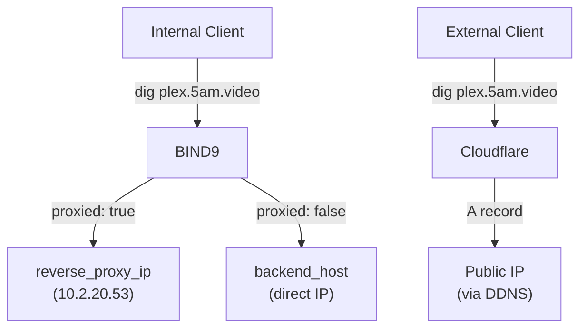
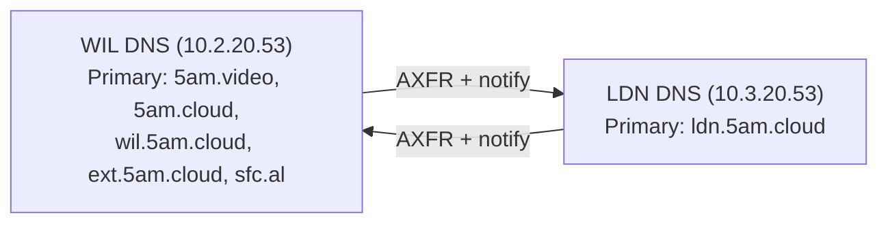
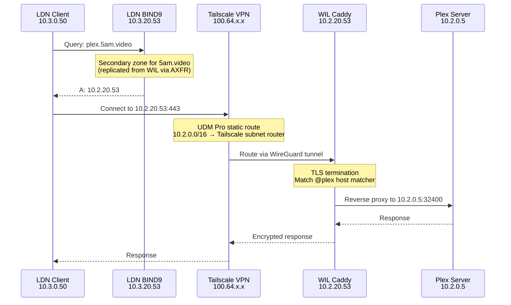

# DNS Services (BIND9)

BIND9 provides internal authoritative DNS with split-horizon resolution across all environments. Internal clients resolve service hostnames to local IPs, while external clients resolve via Cloudflare to public IPs.

!!! tip
    For an overview of the full networking stack, see [Networking](index.md).

## File Locations

| File | Purpose |
|------|---------|
| `playbooks/infrastructure/networking/tasks/bind9.yml` | Installation and configuration task |
| `playbooks/infrastructure/networking/templates/named.conf.j2` | Main BIND9 configuration |
| `playbooks/infrastructure/networking/templates/domain.zone.j2` | Per-domain zone file template |
| `playbooks/infrastructure/networking/templates/reverse.zone.j2` | Reverse DNS zone template |
| `environments/<env>/group_vars/infra_networking/bind9.yml` | Per-environment DNS variables |
| `environments/<env>/group_vars/all/vars.yml` | Domain list (`domains` variable) |

## Split-Horizon DNS

The DNS server returns different IPs based on where the query originates:



- **Proxied services** (`proxied: true`) resolve to `reverse_proxy_ip` — traffic goes through Caddy for TLS termination and routing
- **Non-proxied services** (`proxied: false`) resolve directly to `backend_host` — clients connect to the backend IP without Caddy

This logic lives in the `domain.zone.j2` template:

```jinja2
{{ service.name }} IN A {{ reverse_proxy_ip if service.proxied else service.backend_host }}
```

<small>**Source:** `ansible/playbooks/infrastructure/networking/templates/domain.zone.j2`</small>

## Zone Configuration

BIND9 generates zone files from two data sources:

1. **`domains`** — list in `group_vars/all/vars.yml` defines which zones this server is authoritative for
2. **`services`** — aggregated service list provides A records within each zone

For each domain, the `domain.zone.j2` template generates:

- SOA and NS records with the DNS server as nameserver
- A records for every enabled service matching that domain
- Serial number from the current epoch (auto-increments on each deploy)
- TTL of 300 seconds (5 minutes)

=== "WIL"

    ```yaml
    # environments/wil/group_vars/all/vars.yml
    domains:
      - name: "5am.video"
      - name: "5am.cloud"
      - name: "wil.5am.cloud"
      - name: "ext.5am.cloud"
      - name: "sfc.al"
    ```

=== "LDN"

    ```yaml
    # environments/ldn/group_vars/all/vars.yml
    domains:
      - name: "ldn.5am.cloud"
    ```

<small>**Sources:** `ansible/environments/<env>/group_vars/all/vars.yml` · `ansible/playbooks/infrastructure/networking/templates/domain.zone.j2`</small>

## Cross-Site Zone Transfers

WIL and LDN replicate each other's zones as secondaries via AXFR. When a zone changes on the primary, it notifies the secondary, which pulls the updated zone.



| Zone | Primary | Secondary |
|------|---------|-----------|
| `5am.video` | WIL (`10.2.20.53`) | LDN (`10.3.20.53`) |
| `5am.cloud` | WIL (`10.2.20.53`) | LDN (`10.3.20.53`) |
| `wil.5am.cloud` | WIL (`10.2.20.53`) | LDN (`10.3.20.53`) |
| `ext.5am.cloud` | WIL (`10.2.20.53`) | LDN (`10.3.20.53`) |
| `sfc.al` | WIL (`10.2.20.53`) | LDN (`10.3.20.53`) |
| `ldn.5am.cloud` | LDN (`10.3.20.53`) | WIL (`10.2.20.53`) |

Zone transfer configuration is set per-environment:

=== "WIL"

    ```yaml
    # WIL replicates ldn.5am.cloud from LDN
    dns_secondary_zones:
      - name: "ldn.5am.cloud"
        masters:
          - "10.3.20.53"

    dns_transfer_clients:
      - "10.3.20.53"
      - "100.64.0.0/10"

    dns_notify_targets:
      - "10.3.20.53"
    ```

=== "LDN"

    ```yaml
    # LDN replicates all WIL zones
    dns_secondary_zones:
      - name: "5am.video"
        masters:
          - "10.2.20.53"
      - name: "5am.cloud"
        masters:
          - "10.2.20.53"
      - name: "wil.5am.cloud"
        masters:
          - "10.2.20.53"
      - name: "ext.5am.cloud"
        masters:
          - "10.2.20.53"
      - name: "sfc.al"
        masters:
          - "10.2.20.53"

    dns_transfer_clients:
      - "10.2.20.53"
      - "100.64.0.0/10"

    dns_notify_targets:
      - "10.2.20.53"
    ```

!!! note
    Cross-site zone transfers work over Tailscale. The CGNAT range (`100.64.0.0/10`) is included in both `dns_trusted_networks` and `dns_transfer_clients` to allow queries and transfers through the VPN tunnel.

<small>**Sources:** `ansible/environments/wil/group_vars/infra_networking/bind9.yml` · `ansible/environments/ldn/group_vars/infra_networking/bind9.yml`</small>

### Cross-Site Query Flow

When an LDN client accesses a WIL service (e.g., `plex.5am.video`), the query is resolved locally from the replicated secondary zone — no live forwarding to WIL is needed. The resulting IP routes through Tailscale to reach WIL's Caddy.



Key points:

- **No live DNS forwarding** — LDN BIND9 answers from its local secondary copy of the `5am.video` zone, so the query resolves instantly without crossing the VPN
- **Zone data reflects WIL's `reverse_proxy_ip`** — the replicated A record points to `10.2.20.53` (WIL Caddy), not `10.3.20.53` (LDN Caddy)
- **Traffic routing** — the [UDM Pro static route](unifi.md#static-routes) sends `10.2.0.0/16` traffic to the Tailscale subnet router, which tunnels it to WIL
- **Full TLS chain** — Caddy terminates TLS on the WIL side using the wildcard certificate for `*.5am.video`

<small>**Sources:** `ansible/environments/ldn/group_vars/infra_networking/bind9.yml` · `ansible/playbooks/infrastructure/networking/templates/named.conf.j2`</small>

## Reverse DNS (PTR Records)

Reverse DNS maps IP addresses back to hostnames. Each environment defines a reverse zone for its services subnet and a list of PTR records.

```yaml
dns_reverse_zone: "20.2.10.in-addr.arpa"

dns_ptr_records:
  - octet: "9"
    hostname: "ca.wil.5am.cloud."
  - octet: "53"
    hostname: "dns.wil.5am.cloud."
  - octet: "123"
    hostname: "time.wil.5am.cloud."
```

The `octet` is the last octet of the IP address. The `hostname` must end with a trailing dot (`.`).

<small>**Sources:** `ansible/environments/<env>/group_vars/infra_networking/bind9.yml` · `ansible/playbooks/infrastructure/networking/templates/reverse.zone.j2`</small>

## Configuration Reference

All variables are set in `ansible/environments/<env>/group_vars/infra_networking/bind9.yml`.

---

### `dns_forwarders`

Upstream DNS servers for recursive queries. Used when BIND9 cannot resolve a domain from its own zones.

**Type:** `list[string]`

**Default:** `["1.1.1.1", "1.0.0.1"]`

```yaml
dns_forwarders:
  - "1.1.1.1"
  - "1.0.0.1"
```

<small>**Source:** `ansible/playbooks/infrastructure/networking/templates/named.conf.j2`</small>

---

### `dns_trusted_networks`

Networks allowed to query the DNS server and use recursion. Queries from outside these networks are refused.

**Type:** `list[string]`

```yaml
dns_trusted_networks:
  - localhost
  - localnets
  - 10.2.0.0/16         # local network
  - 10.3.0.0/16         # cross-site network
  - 100.64.0.0/10       # Tailscale CGNAT
```

<small>**Source:** `ansible/playbooks/infrastructure/networking/templates/named.conf.j2`</small>

---

### `dns_secondary_zones`

Zones to replicate from remote primaries via AXFR. Each entry specifies the zone name and the IP(s) of the primary server(s).

**Type:** `list[object]`

```yaml
dns_secondary_zones:
  - name: "ldn.5am.cloud"
    masters:
      - "10.3.20.53"
```

<small>**Source:** `ansible/playbooks/infrastructure/networking/templates/named.conf.j2`</small>

---

### `dns_transfer_clients`

IPs or CIDRs allowed to pull AXFR zone transfers from this server.

**Type:** `list[string]`

```yaml
dns_transfer_clients:
  - "10.3.20.53"
  - "100.64.0.0/10"
```

<small>**Source:** `ansible/playbooks/infrastructure/networking/templates/named.conf.j2`</small>

---

### `dns_notify_targets`

IPs to notify when a zone changes. Must be specific IPs, not CIDRs. Triggers the secondary to pull the updated zone.

**Type:** `list[string]`

```yaml
dns_notify_targets:
  - "10.3.20.53"
```

<small>**Source:** `ansible/playbooks/infrastructure/networking/templates/named.conf.j2`</small>

---

### `dns_forward_zones`

Zones to forward to external resolvers instead of resolving locally. Accepts either a string (uses default forwarders) or an object with custom forwarders.

**Type:** `list[string | object]`

**Default:** `[]`

```yaml
# Simple: forward using dns_forwarders
dns_forward_zones:
  - "example.com"

# Custom forwarders
dns_forward_zones:
  - name: "example.com"
    forwarders:
      - "8.8.8.8"
```

<small>**Source:** `ansible/playbooks/infrastructure/networking/templates/named.conf.j2`</small>

---

### `reverse_proxy_ip`

IP address used for DNS A records of proxied services. This is the IP of the Caddy reverse proxy — typically the networking VM itself.

**Type:** `string`

```yaml
reverse_proxy_ip: "10.2.20.53"
```

<small>**Source:** `ansible/playbooks/infrastructure/networking/templates/domain.zone.j2`</small>

---

### `dns_reverse_zone`

Reverse DNS zone name, derived from the services subnet. Follows the `in-addr.arpa` convention.

**Type:** `string`

```yaml
dns_reverse_zone: "20.2.10.in-addr.arpa"    # for 10.2.20.x
```

<small>**Source:** `ansible/playbooks/infrastructure/networking/templates/named.conf.j2`</small>

---

### `dns_ptr_records`

PTR records for reverse DNS lookups. Each entry maps the last IP octet to a fully-qualified hostname.

**Type:** `list[object]`

```yaml
dns_ptr_records:
  - octet: "53"
    hostname: "dns.wil.5am.cloud."
```

!!! note
    The `hostname` must end with a trailing dot (`.`) to be treated as a FQDN.

<small>**Source:** `ansible/playbooks/infrastructure/networking/templates/reverse.zone.j2`</small>

## Common Tasks

### Add a PTR record

1. Edit `ansible/environments/<env>/group_vars/infra_networking/bind9.yml`
2. Add an entry to `dns_ptr_records`:

    ```yaml
    dns_ptr_records:
      # ... existing entries
      - octet: "60"
        hostname: "work.wil.5am.cloud."
    ```

3. Deploy:

    ```bash
    task ansible:deploy-networking ENV=wil
    ```

### Add a forward zone

1. Edit `ansible/environments/<env>/group_vars/infra_networking/bind9.yml`
2. Add an entry to `dns_forward_zones`:

    ```yaml
    dns_forward_zones:
      - name: "corp.example.com"
        forwarders:
          - "192.168.1.1"
    ```

3. Deploy:

    ```bash
    task ansible:deploy-networking ENV=wil
    ```

### Configure zone transfer to a new secondary

On the **primary** server's `bind9.yml`:

1. Add the secondary IP to `dns_transfer_clients`
2. Add the secondary IP to `dns_notify_targets`

On the **secondary** server's `bind9.yml`:

1. Add zones to `dns_secondary_zones` with the primary's IP as master
2. Add the primary IP to `dns_transfer_clients` (for reciprocal transfers)

Ensure network connectivity between servers (direct or via [Tailscale](tailscale.md)).

### Verify DNS resolution

```bash
# Query a specific DNS server
dig plex.5am.video @10.2.20.53

# Check a PTR record
dig -x 10.2.20.53 @10.2.20.53

# Verify zone transfer
dig AXFR 5am.video @10.2.20.53
```
