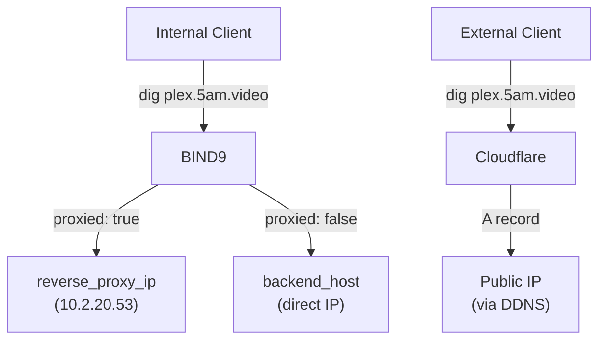
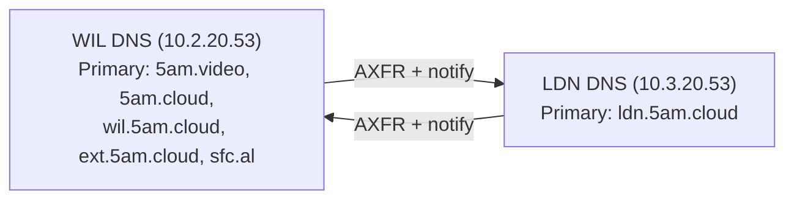
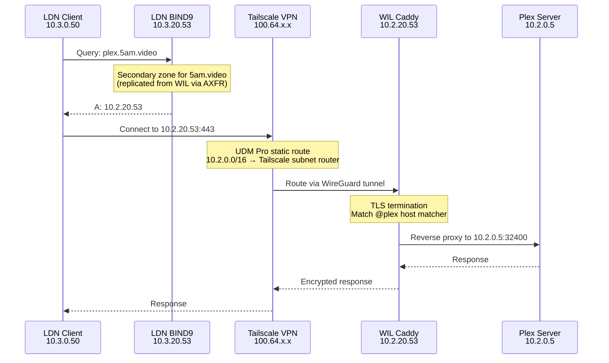

# DNS Services (BIND9)

BIND9 provides internal authoritative DNS with split-horizon resolution across all environments. Internal clients resolve service hostnames to local IPs, while external clients resolve via Cloudflare to public IPs.

## File Locations

| File | Purpose |
|------|---------|
| `ansible/playbooks/infrastructure/networking/tasks/bind9.yml` | Installation and configuration task |
| `ansible/playbooks/infrastructure/networking/templates/named.conf.j2` | Main BIND9 configuration |
| `ansible/playbooks/infrastructure/networking/templates/domain.zone.j2` | Per-domain zone file template |
| `ansible/playbooks/infrastructure/networking/templates/reverse.zone.j2` | Reverse DNS zone template |
| `ansible/environments/<env>/group_vars/infra_networking/bind9.yml` | Per-environment DNS variables |
| `ansible/environments/<env>/group_vars/all/vars.yml` | Domain list (`domains` variable) |

## Split-Horizon DNS

The DNS server returns different IPs based on where the query originates:



- **Proxied services** (`proxied: true`) resolve to `reverse_proxy_ip` — traffic goes through Caddy for TLS termination and routing
- **Non-proxied services** (`proxied: false`) resolve directly to `backend_host` — clients connect to the backend IP without Caddy

This logic lives in the `domain.zone.j2` template:

```jinja2
{{ service.name }} IN A {{ reverse_proxy_ip if service.proxied else service.backend_host }}
```

## Zone Configuration

BIND9 generates zone files from two data sources:

1. **`domains`** — list in `group_vars/all/vars.yml` defines which zones this server is authoritative for
2. **`services`** — aggregated service list provides A records within each zone

For each domain, the `domain.zone.j2` template generates:

- SOA and NS records with the DNS server as nameserver
- A records for every enabled service matching that domain
- Serial number from the current epoch (auto-increments on each deploy)
- TTL of 300 seconds (5 minutes)

=== "WIL"

    ```yaml
    # environments/wil/group_vars/all/vars.yml
    domains:
      - name: "5am.video"
      - name: "5am.cloud"
      - name: "wil.5am.cloud"
      - name: "ext.5am.cloud"
      - name: "sfc.al"
    ```

=== "LDN"

    ```yaml
    # environments/ldn/group_vars/all/vars.yml
    domains:
      - name: "ldn.5am.cloud"
    ```

## Cross-Site Zone Transfers

WIL and LDN replicate each other's zones as secondaries via AXFR. When a zone changes on the primary, it notifies the secondary, which pulls the updated zone.



| Zone | Primary | Secondary |
|------|---------|-----------|
| `5am.video` | WIL (`10.2.20.53`) | LDN (`10.3.20.53`) |
| `5am.cloud` | WIL (`10.2.20.53`) | LDN (`10.3.20.53`) |
| `wil.5am.cloud` | WIL (`10.2.20.53`) | LDN (`10.3.20.53`) |
| `ext.5am.cloud` | WIL (`10.2.20.53`) | LDN (`10.3.20.53`) |
| `sfc.al` | WIL (`10.2.20.53`) | LDN (`10.3.20.53`) |
| `ldn.5am.cloud` | LDN (`10.3.20.53`) | WIL (`10.2.20.53`) |

Zone transfer configuration is set per-environment:

=== "WIL"

    ```yaml
    # WIL replicates ldn.5am.cloud from LDN
    dns_secondary_zones:
      - name: "ldn.5am.cloud"
        masters:
          - "10.3.20.53"

    dns_transfer_clients:
      - "10.3.20.53"
      - "100.64.0.0/10"

    dns_notify_targets:
      - "10.3.20.53"
    ```

=== "LDN"

    ```yaml
    # LDN replicates all WIL zones
    dns_secondary_zones:
      - name: "5am.video"
        masters:
          - "10.2.20.53"
      - name: "5am.cloud"
        masters:
          - "10.2.20.53"
      - name: "wil.5am.cloud"
        masters:
          - "10.2.20.53"
      - name: "ext.5am.cloud"
        masters:
          - "10.2.20.53"
      - name: "sfc.al"
        masters:
          - "10.2.20.53"

    dns_transfer_clients:
      - "10.2.20.53"
      - "100.64.0.0/10"

    dns_notify_targets:
      - "10.2.20.53"
    ```

!!! note
    Cross-site zone transfers work over Tailscale. The CGNAT range (`100.64.0.0/10`) is included in both `dns_trusted_networks` and `dns_transfer_clients` to allow queries and transfers through the VPN tunnel.

### Cross-Site Query Flow

When an LDN client accesses a WIL service (e.g., `plex.5am.video`), the query is resolved locally from the replicated secondary zone — no live forwarding to WIL is needed. The resulting IP routes through Tailscale to reach WIL's Caddy.



Key points:

- **No live DNS forwarding** — LDN BIND9 answers from its local secondary copy of the `5am.video` zone, so the query resolves instantly without crossing the VPN
- **Zone data reflects WIL's `reverse_proxy_ip`** — the replicated A record points to `10.2.20.53` (WIL Caddy), not `10.3.20.53` (LDN Caddy)
- **Traffic routing** — the [UDM Pro static route](unifi.md#static-routes) sends `10.2.0.0/16` traffic to the Tailscale subnet router, which tunnels it to WIL
- **Full TLS chain** — Caddy terminates TLS on the WIL side using the wildcard certificate for `*.5am.video`

## Reverse DNS (PTR Records)

Reverse DNS maps IP addresses back to hostnames. Each environment defines a reverse zone for its services subnet and a list of PTR records.

```yaml
dns_reverse_zone: "20.2.10.in-addr.arpa"

dns_ptr_records:
  - octet: "9"
    hostname: "ca.wil.5am.cloud."
  - octet: "53"
    hostname: "dns.wil.5am.cloud."
  - octet: "123"
    hostname: "time.wil.5am.cloud."
```

The `octet` is the last octet of the IP address. The `hostname` must end with a trailing dot (`.`).

## Configuration Reference

All variables are set in `ansible/environments/<env>/group_vars/infra_networking/bind9.yml`.

| Parameter | Type | Description | Default |
|-----------|------|-------------|---------|
| `dns_forwarders` | `list[string]` | Upstream DNS servers for recursive queries | `["1.1.1.1", "1.0.0.1"]` |
| `dns_trusted_networks` | `list[string]` | Networks allowed to query and use recursion | (per-env) |
| `dns_secondary_zones` | `list[object]` | Zones to replicate from remote primaries via AXFR | `[]` |
| `dns_transfer_clients` | `list[string]` | IPs/CIDRs allowed to pull AXFR zone transfers | `[]` |
| `dns_notify_targets` | `list[string]` | IPs to notify on zone changes (must be IPs, not CIDRs) | `[]` |
| `dns_forward_zones` | `list[string\|object]` | Zones to forward to external resolvers | `[]` |
| `reverse_proxy_ip` | `string` | IP for DNS A records of proxied services (Caddy IP) | (per-env) |
| `dns_reverse_zone` | `string` | Reverse DNS zone name (`in-addr.arpa` format) | (per-env) |
| `dns_ptr_records` | `list[object]` | PTR records mapping last IP octet to FQDN (trailing dot required) | `[]` |

## Common Tasks

### Add a PTR record

1. Edit `ansible/environments/<env>/group_vars/infra_networking/bind9.yml`
2. Add an entry to `dns_ptr_records`:

    ```yaml
    dns_ptr_records:
      # ... existing entries
      - octet: "60"
        hostname: "work.wil.5am.cloud."
    ```

3. Deploy:

    ```bash
    task ansible:deploy-networking ENV=wil
    ```

### Add a forward zone

1. Edit `ansible/environments/<env>/group_vars/infra_networking/bind9.yml`
2. Add an entry to `dns_forward_zones`:

    ```yaml
    dns_forward_zones:
      - name: "corp.example.com"
        forwarders:
          - "192.168.1.1"
    ```

3. Deploy:

    ```bash
    task ansible:deploy-networking ENV=wil
    ```

### Configure zone transfer to a new secondary

On the **primary** server's `bind9.yml`:

1. Add the secondary IP to `dns_transfer_clients`
2. Add the secondary IP to `dns_notify_targets`

On the **secondary** server's `bind9.yml`:

1. Add zones to `dns_secondary_zones` with the primary's IP as master
2. Add the primary IP to `dns_transfer_clients` (for reciprocal transfers)

Ensure network connectivity between servers (direct or via [Tailscale](tailscale.md)).

### Verify DNS resolution

```bash
# Query a specific DNS server
dig plex.5am.video @10.2.20.53

# Check a PTR record
dig -x 10.2.20.53 @10.2.20.53

# Verify zone transfer
dig AXFR 5am.video @10.2.20.53
```

## Troubleshooting

**Service not resolving** — Check BIND9 is running: `ssh <networking-ip> docker logs bind9`. Verify the service has an entry in the correct domain file under `group_vars/all/proxy/` and redeploy: `task ansible:deploy-networking ENV=wil`.

**Wrong IP returned** — If a proxied service resolves to `backend_host` instead of `reverse_proxy_ip`, check that `proxied: true` is set. If a non-proxied service resolves to the Caddy IP, check that `proxied: false` is set.

**Zone transfer not working** — Verify Tailscale connectivity between sites. Check that `dns_transfer_clients` includes the remote DNS server IP and the CGNAT range. Test with `dig AXFR <zone> @<primary-dns>`.

**Serial number not incrementing** — Zone serials use the current epoch. If BIND9 doesn't pick up changes, restart the container: `ssh <networking-ip> docker restart bind9`.
