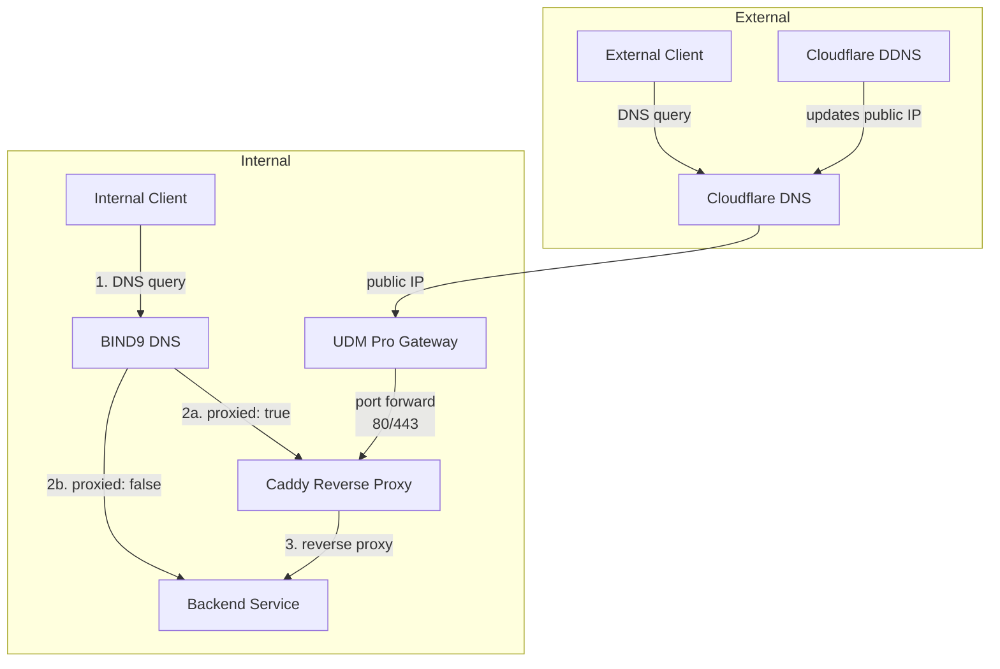
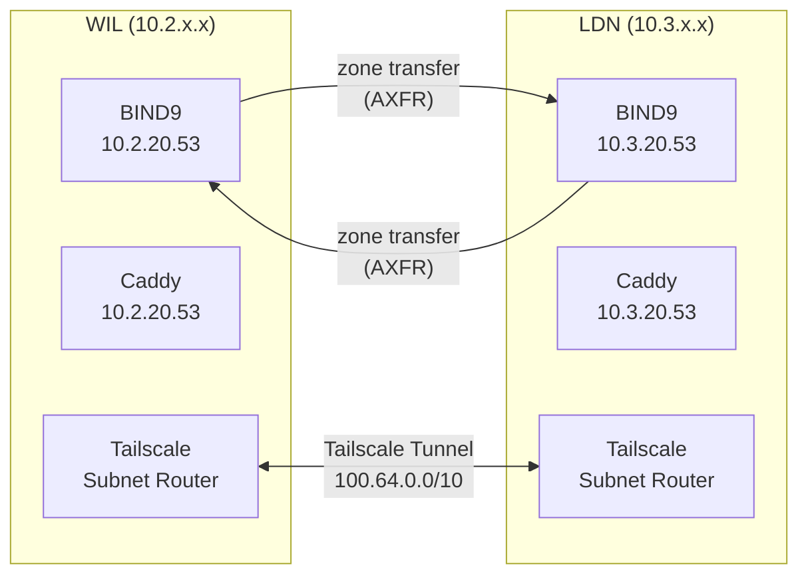
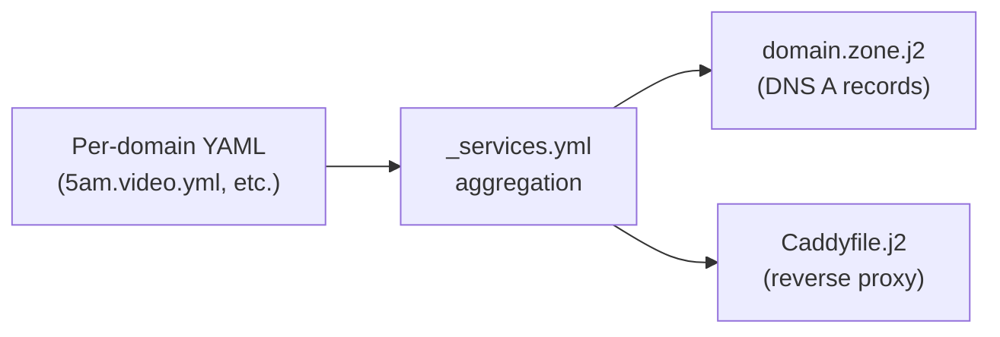

# Networking

The networking stack provides DNS resolution, reverse proxying, dynamic DNS, and VPN connectivity across all environments. It deploys as a single Ansible playbook and is the first infrastructure service to run — all other services depend on it.

!!! warning "Deploy networking first"
    The networking playbook must run before any other service. DNS and reverse proxy availability are prerequisites for CA, NTP, monitoring, and all application deployments.

## Architecture



Internal clients query BIND9 for service hostnames. Proxied services resolve to the Caddy reverse proxy IP, which terminates TLS and forwards to backends. Non-proxied services resolve directly to the backend IP. External clients resolve via Cloudflare DNS and reach Caddy over the public IP — the [UDM Pro](unifi.md) port-forwards ports 80/443 to Caddy, and DDNS keeps the public IP current.

## Components

| Component | Purpose | Docs |
|-----------|---------|------|
| [UniFi UDM Pro](unifi.md) | Gateway, VLANs, static routes, port forwarding | [Gateway](unifi.md) |
| [BIND9](dns.md) | Internal authoritative DNS with split-horizon resolution | [DNS Services](dns.md) |
| [Caddy](proxy.md) | Reverse proxy with automatic wildcard TLS via Cloudflare | [Reverse Proxy](proxy.md) |
| [Tailscale](tailscale.md) | Encrypted WireGuard VPN mesh between sites | [VPN](tailscale.md) |
| Cloudflare DDNS | Updates public DNS records with current public IP | [Below](#cloudflare-ddns) |

## Multi-Site Topology



Each environment runs a [UDM Pro gateway](unifi.md) with VLANs and a networking VM at `.53` on VLAN 20. WIL is the primary DNS for 5 domains; LDN is primary for `ldn.5am.cloud`. Each site replicates the other's zones as secondary via AXFR. Tailscale subnet routers provide L3 connectivity between sites over the CGNAT range (`100.64.0.0/10`), with [static routes on the UDM Pro](unifi.md#static-routes) directing cross-site traffic to the Tailscale VM.

| Environment | Network | DNS Server | Domains (primary) |
|-------------|---------|------------|-------------------|
| WIL | `10.2.0.0/16` | `10.2.20.53` | `5am.video`, `5am.cloud`, `wil.5am.cloud`, `ext.5am.cloud`, `sfc.al` |
| LDN | `10.3.0.0/16` | `10.3.20.53` | `ldn.5am.cloud` |

## IP Address Allocation

Infrastructure VMs use consistent IP suffixes across environments:

| Service | Suffix | WIL IP | LDN IP |
|---------|--------|--------|--------|
| Networking (DNS, Caddy, Tailscale) | `.53` | `10.2.20.53` | `10.3.20.53` |
| Certificate Authority (Step-CA) | `.9` | `10.2.20.9` | `10.3.20.9` |
| NTP Server (Chrony) | `.123` | `10.2.20.123` | `10.3.20.123` |
| Monitoring (Prometheus, Grafana) | `.30` | `10.2.20.30` | `10.3.20.30` |

## Service Definition System

A unified YAML service model drives both DNS records and Caddy reverse proxy configuration. Each service is defined once and consumed by both BIND9 zone templates and the Caddyfile template.



Service definitions live in `ansible/environments/<env>/group_vars/all/proxy/` with one file per domain. The `_services.yml` file aggregates all domain lists and injects the `domain` field automatically.

See [Reverse Proxy — Service Definition Reference](proxy.md#service-definition-reference) for the full field specification.

## Deployment

Deploy the full networking stack:

```bash
task ansible:deploy-networking ENV=wil
```

The playbook targets the `infra_networking` host group and runs four components in order:

1. **BIND9** — DNS server configuration and zone files
2. **Cloudflare DDNS** — dynamic DNS updater container
3. **Caddy** — reverse proxy with TLS
4. **Tailscale** — VPN mesh (via role)

### Deployment Order

Networking deploys first in the infrastructure stack. The dependency chain:

```
Networking → Step-CA → NTP → Monitoring → Applications
```

### File Locations

| File | Purpose |
|------|---------|
| `ansible/playbooks/infrastructure/networking/deploy.yml` | Main playbook |
| `ansible/playbooks/infrastructure/networking/tasks/` | Per-component task files |
| `ansible/playbooks/infrastructure/networking/templates/` | Jinja2 config templates |
| `ansible/playbooks/infrastructure/networking/handlers/main.yml` | Service restart handlers |
| `ansible/environments/<env>/group_vars/infra_networking/` | Per-environment variables |
| `ansible/environments/<env>/group_vars/all/proxy/` | Service definitions |

## Cloudflare DDNS

Cloudflare DDNS runs as a Docker container using the [`favonia/cloudflare-ddns`](https://github.com/favonia/cloudflare-ddns) image in host network mode. It detects the public IP and updates specified Cloudflare DNS records.

### Configuration

Edit `ansible/environments/<env>/group_vars/infra_networking/ddns.yml`:

```yaml
ddns_domains:
  - "plex.5am.video"
  - "convert.wil.5am.cloud"
```

### `ddns_domains`

FQDNs to keep updated with the current public IP.

**Type:** `list[string]`

```yaml
ddns_domains:
  - "plex.5am.video"
```

The container runs with minimal privileges (all capabilities dropped, read-only filesystem, no new privileges) and uses the `CF_API_TOKEN` from SOPS-encrypted secrets for Cloudflare API access.
