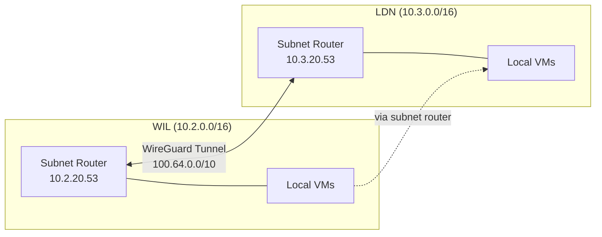

# VPN (Tailscale)

Tailscale creates an encrypted WireGuard mesh network between geographically distributed environments. Subnet routers on each site's networking VM advertise local subnets, enabling cross-site communication over the CGNAT range (`100.64.0.0/10`).

!!! tip
    For an overview of the full networking stack, see [Networking](index.md).

## File Locations

| File | Purpose |
|------|---------|
| `roles/tailscale/tasks/main.yml` | Installation, configuration, and authentication |
| `roles/tailscale/defaults/main.yml` | Default variable values |
| `roles/tailscale/handlers/main.yml` | Service restart handler |

## Deployment Modes

Tailscale supports two modes, controlled by `tailscale_mode`:

### Client

Default mode. Joins the Tailscale mesh as a regular node. Accepts routes from subnet routers to reach other sites.

### Subnet Router

Advertises local network routes to the mesh. Used on networking VMs to make an entire site reachable from other sites. Enables:

- **IP forwarding** — `net.ipv4.ip_forward=1` and `net.ipv6.conf.all.forwarding=1` via sysctl
- **NAT masquerade** — iptables rule for `100.64.0.0/10` traffic so Tailscale clients can reach non-Tailscale hosts on the local network
- **Systemd override** — ensures `tailscaled` starts after the network is online



## Configuration Reference

All variables are set in the host or group vars for machines running Tailscale. Defaults are defined in `ansible/roles/tailscale/defaults/main.yml`.

---

### `tailscale_mode`

Deployment mode. `"client"` joins the mesh as a regular node. `"subnet_router"` advertises local routes and enables IP forwarding.

**Type:** `string`

**Default:** `"client"`

**Possible values:** `"client"`, `"subnet_router"`

```yaml
tailscale_mode: "subnet_router"
```

---

### `tailscale_auth_key`

Authentication key from the Tailscale admin console. Generate under Settings → Keys → Generate auth key. Enable **Reusable** and **Pre-approved** for automated deployments.

**Type:** `string`

**Default:** `""`

!!! warning
    Store auth keys in SOPS-encrypted secrets files, never in plaintext group vars.

```yaml
tailscale_auth_key: "{{ tailscale_auth_key_secret }}"
```

---

### `tailscale_advertise_routes`

CIDR ranges to advertise to the Tailscale mesh. Only used when `tailscale_mode` is `"subnet_router"`.

**Type:** `list[string]`

**Default:** `[]`

```yaml
tailscale_advertise_routes:
  - "10.2.0.0/16"
```

!!! note
    After deploying, routes must be approved in the Tailscale admin console before other nodes can use them.

---

### `tailscale_accept_dns`

Accept DNS configuration from Tailscale. Subnet routers running BIND9 should set this to `false` to avoid conflicts with the local DNS server.

**Type:** `boolean`

**Default:** `true`

```yaml
tailscale_accept_dns: false
```

---

### `tailscale_accept_routes`

Accept routes advertised by other Tailscale nodes. Client nodes that need to reach other sites should set this to `true`.

**Type:** `boolean`

**Default:** `false`

```yaml
tailscale_accept_routes: true
```

---

### `tailscale_hostname`

Hostname as it appears in the Tailscale admin console.

**Type:** `string`

**Default:** `"{{ inventory_hostname }}"`

```yaml
tailscale_hostname: "wil-networking"
```

---

### `tailscale_force_reauth`

Force re-authentication on the next Ansible run. Use when the auth key has changed or the node needs to rejoin the mesh.

**Type:** `boolean`

**Default:** `false`

```yaml
tailscale_force_reauth: true
```

## Cross-Site Connectivity

Tailscale subnet routers enable three critical cross-site functions. For non-Tailscale devices on the local network to use these routes, the [UDM Pro must have static routes](unifi.md#static-routes) pointing remote subnets at the Tailscale subnet router VM.

### DNS Zone Transfers

WIL and LDN DNS servers replicate zones via AXFR. The BIND9 servers reach each other through Tailscale using their local IPs (e.g., WIL queries LDN at `10.3.20.53`), which the subnet routers make routable. See [DNS — Cross-Site Zone Transfers](dns.md#cross-site-zone-transfers).

### Service Access

Services on one site can be accessed from the other. For example, a client in LDN can reach `plex.5am.video` because:

1. LDN BIND9 has `5am.video` as a secondary zone (replicated from WIL)
2. The A record resolves to WIL's `reverse_proxy_ip` (`10.2.20.53`)
3. Tailscale routes traffic to `10.2.20.53` through the WireGuard tunnel

### Trusted Network Configuration

Both sites include the Tailscale CGNAT range in their BIND9 trusted networks:

```yaml
dns_trusted_networks:
  - 100.64.0.0/10  # Tailscale CGNAT
```

This allows DNS queries and zone transfers originating from Tailscale IPs.

## DNS Integration

Networking VMs run both BIND9 and Tailscale. To prevent Tailscale from overriding the local DNS configuration:

```yaml
tailscale_accept_dns: false
```

Without this, Tailscale would push its own DNS servers (MagicDNS), which would conflict with the locally running BIND9 instance.

## Security

| Aspect | Implementation |
|--------|---------------|
| Encryption | All traffic uses WireGuard encryption (always on) |
| Authentication | Auth keys stored as SOPS-encrypted secrets |
| NAT traversal | Coordinated by Tailscale control plane; no public ports needed |
| IP forwarding | Enabled only on subnet routers, not clients |
| DNS isolation | Subnet routers disable Tailscale DNS to avoid BIND9 conflicts |
| Access control | Tailscale ACLs control which nodes can communicate |

## Common Tasks

### Set up a new subnet router

1. Set the Tailscale variables in the host's group vars:

    ```yaml
    tailscale_mode: "subnet_router"
    tailscale_auth_key: "{{ tailscale_auth_key_secret }}"
    tailscale_advertise_routes:
      - "10.2.0.0/16"
    tailscale_accept_dns: false
    tailscale_accept_routes: true
    ```

2. Deploy:

    ```bash
    task ansible:deploy-networking ENV=wil
    ```

3. Approve the advertised routes in the [Tailscale admin console](https://login.tailscale.com/admin/machines)

### Add a new site

1. Set up Tailscale on the new site's networking VM as a subnet router (see above)
2. On existing sites, ensure `tailscale_accept_routes: true` so they accept the new site's routes
3. Add [static routes on each site's UDM Pro](unifi.md#adding-a-new-site-route) pointing the new subnet at the local Tailscale VM
4. Add the new site's subnet to `dns_trusted_networks` on existing DNS servers
5. Configure zone transfers between the new site and existing sites (see [DNS — Configure zone transfer to a new secondary](dns.md#configure-zone-transfer-to-a-new-secondary))
6. Deploy all affected environments

### Force re-authentication

If a node's auth key expires or the node needs to rejoin:

1. Set `tailscale_force_reauth: true` in the host's vars
2. Deploy:

    ```bash
    task ansible:deploy-networking ENV=wil
    ```

3. Reset `tailscale_force_reauth: false` after successful authentication to avoid re-authing on every future run
