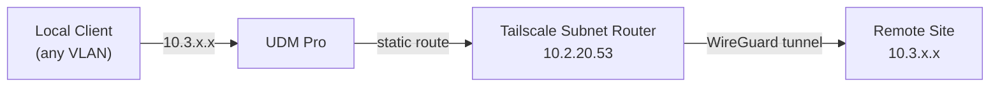
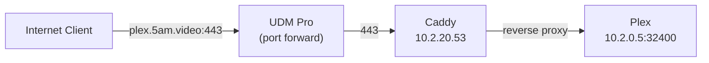

# Gateway (UniFi)

Each site runs a UniFi Dream Machine Pro (UDM Pro) as the network gateway. The UDM Pro handles VLANs, inter-VLAN routing, static routes for Tailscale, and port forwarding for the reverse proxy. Gateway configuration is managed manually through the UniFi controller UI — it is not automated via Ansible.

!!! tip
    For the software-defined networking stack deployed on top of this gateway, see [Networking](index.md).

## VLANs

Each environment uses the same VLAN layout with environment-specific IP ranges.

=== "WIL"

    | VLAN | Name | Subnet | Purpose |
    |------|------|--------|---------|
    | 1 | Infrastructure | `10.2.0.0/24` | Proxmox hosts, NAS, physical infrastructure |
    | 10 | Storage | `10.2.10.0/24` | Dedicated storage traffic |
    | 20 | Virtual Machines | `10.2.20.0/24` | All Ansible-managed VMs |
    | 30 | Servers Misc | `10.2.30.0/24` | Miscellaneous server devices |
    | 200 | Wired Devices | `10.2.200.0/24` | Wired client devices |
    | 230 | Wireless Devices | `10.2.230.0/24` | Wi-Fi client devices |
    | 245 | IoT Devices | `10.2.245.0/24` | IoT and smart home devices |

=== "LDN"

    | VLAN | Name | Subnet | Purpose |
    |------|------|--------|---------|
    | 1 | Infrastructure | `10.3.0.0/24` | Proxmox hosts, NAS, physical infrastructure |
    | 20 | Virtual Machines | `10.3.20.0/24` | All Ansible-managed VMs |

=== "NYC"

    | VLAN | Name | Subnet | Purpose |
    |------|------|--------|---------|
    | 1 | Infrastructure | `10.1.0.0/24` | Proxmox hosts, physical infrastructure |
    | 10 | Storage | `10.1.10.0/24` | Dedicated storage traffic |
    | 20 | Virtual Machines | `10.1.20.0/24` | All Ansible-managed VMs |
    | 30 | PTP Devices | `10.1.50.0/24` | Point-to-point devices |
    | 200 | Wired Devices | `10.1.200.0/24` | Wired client devices |
    | 230 | Wireless Devices | `10.1.230.0/24` | Wi-Fi client devices |

All Ansible-managed infrastructure and application VMs live on **VLAN 20** (Virtual Machines). The networking VM at `.53`, CA at `.9`, NTP at `.123`, and monitoring at `.30` are all on this VLAN.

## Static Routes

Static routes on the UDM Pro direct traffic for remote site subnets through the local Tailscale subnet router. Without these routes, traffic destined for other sites would be sent to the default gateway (the ISP) instead of through the Tailscale tunnel.

### Why Static Routes Are Needed

The Tailscale subnet router VM advertises remote subnets to the Tailscale mesh, but the UDM Pro doesn't participate in Tailscale. Other VMs and physical devices on the network need a route to reach the remote subnets, so the UDM Pro must be told to forward that traffic to the Tailscale subnet router.

### Configuration

In the UniFi controller: **Settings → Routing → Static Routes**

=== "WIL"

    | Name | Destination | Next Hop | Purpose |
    |------|-------------|----------|---------|
    | LDN Network | `10.3.0.0/16` | `10.2.20.53` | Route to LDN via Tailscale |
    | Tailscale CGNAT | `100.64.0.0/10` | `10.2.20.53` | Route to Tailscale mesh IPs |

=== "LDN"

    | Name | Destination | Next Hop | Purpose |
    |------|-------------|----------|---------|
    | WIL Network | `10.2.0.0/16` | `10.3.20.53` | Route to WIL via Tailscale |
    | Tailscale CGNAT | `100.64.0.0/10` | `10.3.20.53` | Route to Tailscale mesh IPs |

!!! note
    The next hop is always the Tailscale subnet router VM (`.53` on VLAN 20). This VM runs Tailscale in `subnet_router` mode with IP forwarding and NAT masquerade enabled. See [VPN (Tailscale) — Deployment Modes](tailscale.md#deployment-modes).

### Adding a New Site Route

When adding a new site to the homelab:

1. Deploy Tailscale on the new site's networking VM as a subnet router (see [Tailscale — Set up a new subnet router](tailscale.md#set-up-a-new-subnet-router))
2. On each existing site's UDM Pro, add a static route:
    - **Destination:** the new site's subnet (e.g., `10.4.0.0/16`)
    - **Next Hop:** the local Tailscale subnet router (e.g., `10.2.20.53`)
3. On the new site's UDM Pro, add static routes for each existing site

## Port Forwarding

Port forwarding rules on the UDM Pro direct inbound internet traffic to the Caddy reverse proxy. This is required for external access to services like Plex and for Caddy to serve HTTPS on the public IP.

### Configuration

In the UniFi controller: **Settings → Firewall & Security → Port Forwarding**

| Name | External Port | Internal IP | Internal Port | Protocol | Purpose |
|------|--------------|-------------|---------------|----------|---------|
| HTTP | 80 | `10.2.20.53` | 80 | TCP | HTTP → Caddy (redirects to HTTPS) |
| HTTPS | 443 | `10.2.20.53` | 443 | TCP | HTTPS → Caddy (reverse proxy) |

Both rules forward to the networking VM (`.53`) where Caddy listens. Caddy handles TLS termination using wildcard certificates obtained via the [Cloudflare DNS-01 challenge](proxy.md#tls-certificate-management) and routes requests to the appropriate backend service.

!!! warning
    Only ports 80 and 443 should be forwarded. Individual services should never be directly exposed — all external traffic routes through Caddy. Services that need external access are configured with [Cloudflare DDNS](index.md#cloudflare-ddns) records pointing to the public IP.

### Traffic Flow

1. External client resolves `plex.5am.video` via Cloudflare DNS → public IP
2. UDM Pro receives traffic on port 443, forwards to `10.2.20.53:443`
3. Caddy terminates TLS, matches the hostname, and proxies to the backend

## Inter-VLAN Routing

The UDM Pro routes traffic between VLANs by default. Key inter-VLAN traffic patterns:

| Source | Destination | Purpose |
|--------|-------------|---------|
| VLAN 200/230 (clients) | VLAN 20 (VMs) | Access services via Caddy |
| VLAN 1 (infrastructure) | VLAN 20 (VMs) | Proxmox managing VMs |
| VLAN 20 (VMs) | VLAN 1 (infrastructure) | VMs accessing NAS storage |
| VLAN 20 (VMs) | VLAN 10 (storage) | Dedicated storage traffic (NFS/iSCSI) |
| VLAN 245 (IoT) | VLAN 20 (VMs) | IoT devices reaching Home Assistant |

!!! tip
    Firewall rules on the UDM Pro can restrict inter-VLAN traffic. For example, IoT devices on VLAN 245 might only be allowed to reach specific IPs on VLAN 20 (like Home Assistant) and nothing else.
