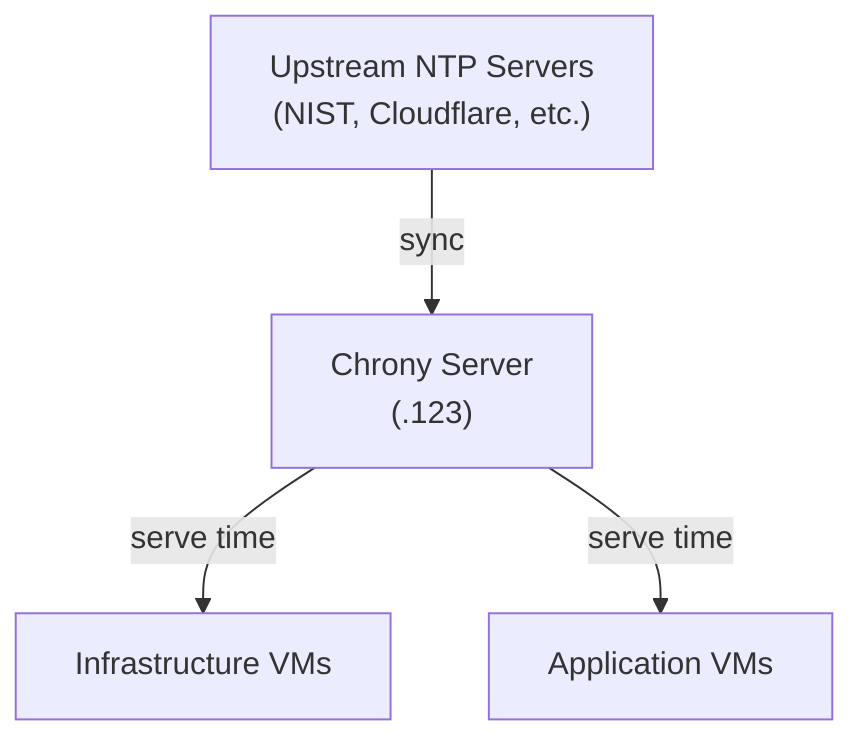

# Time Server (Chrony)

Chrony provides NTP time synchronization for all infrastructure nodes. It runs as a native systemd service on a dedicated VM in each environment, synchronizing from upstream NTP servers and serving time to the local network.

!!! note "Deployment order"
    NTP deploys after [Networking](../networking/index.md) and [Step-CA](../ca/index.md), and before monitoring and applications.

## Architecture



The Chrony server synchronizes with multiple upstream NTP sources and acts as a stratum 10 local clock for the network. All VMs in the environment point to the local Chrony server instead of querying public NTP servers directly.

## File Locations

| File | Purpose |
|------|---------|
| `playbooks/infrastructure/ntp/deploy.yml` | Main playbook |
| `playbooks/infrastructure/ntp/tasks/chrony.yml` | Installation and configuration task |
| `playbooks/infrastructure/ntp/templates/servers.conf.j2` | Upstream NTP server list |
| `playbooks/infrastructure/ntp/templates/allow.conf.j2` | Client access allow list |
| `playbooks/infrastructure/ntp/templates/server.conf.j2` | Server mode settings |
| `playbooks/infrastructure/ntp/handlers/main.yml` | Service restart handler |
| `environments/<env>/group_vars/infra_ntp/chrony.yml` | Per-environment NTP variables |

## Hosts

| Environment | IP | FQDN |
|-------------|----|------|
| WIL | `10.2.20.123` | `time.wil.5am.cloud` |
| LDN | `10.3.20.123` | `time.ldn.5am.cloud` |

## Deployment

```bash
task ansible:deploy-ntp ENV=wil
```

The task file:

1. Installs `chrony` via apt
2. Deploys upstream server configuration to `/etc/chrony/conf.d/servers.conf`
3. Deploys client allow list to `/etc/chrony/conf.d/allow.conf`
4. Deploys server mode config to `/etc/chrony/conf.d/server.conf`
5. Enables and starts the `chrony` service
6. Verifies synchronization with `chronyc tracking`
7. Displays status output

### Server Mode Configuration

The `server.conf.j2` template configures Chrony to operate as a local time source:

```
local stratum 10
rtcsync
hwtimestamp *
```

- `local stratum 10` — acts as a time source even if upstream servers are unreachable
- `rtcsync` — synchronizes the system clock with the hardware clock
- `hwtimestamp *` — enables hardware timestamping on all interfaces for precision

## Configuration Reference

All variables are set in `ansible/environments/<env>/group_vars/infra_ntp/chrony.yml`.

---

### `chrony_ntp_servers`

List of upstream NTP servers to synchronize from. Each server is configured with the `iburst` flag for faster initial synchronization.

**Type:** `list[string]`

=== "WIL"

    ```yaml
    chrony_ntp_servers:
      - clock.nyc.he.net
      - tick.usno.navy.mil
      - tock.usno.navy.mil
      - time-a-g.nist.gov
    ```

=== "LDN"

    ```yaml
    chrony_ntp_servers:
      - ntp1.npl.co.uk
      - ntp2.npl.co.uk
      - time.cloudflare.com
      - nts.netnod.se
    ```

!!! tip
    Each environment uses geographically local NTP servers for lower latency. WIL uses US-based servers (NIST, USNO); LDN uses UK and European servers (NPL, Cloudflare, Netnod).

---

### `chrony_allow`

Networks allowed to query this NTP server. Controls which clients can synchronize time from this server.

**Type:** `list[string]`

=== "WIL"

    ```yaml
    chrony_allow:
      - 10.2.0.0/16
    ```

=== "LDN"

    ```yaml
    chrony_allow:
      - 10.3.0.0/24
    ```

## Common Tasks

### Verify time synchronization

SSH to the NTP server and check the tracking status:

```bash
chronyc tracking
```

Key fields to check:

- **Reference ID** — upstream server currently in use
- **Stratum** — should be 2-3 (one hop from the upstream stratum 1 server)
- **System time** — offset from NTP time (should be sub-millisecond)

### Check connected clients

```bash
chronyc clients
```

### Add a new upstream NTP server

1. Edit `ansible/environments/<env>/group_vars/infra_ntp/chrony.yml`:

    ```yaml
    chrony_ntp_servers:
      # ... existing servers
      - time.google.com
    ```

2. Deploy:

    ```bash
    task ansible:deploy-ntp ENV=wil
    ```

### Allow a new network

1. Add the network CIDR to `chrony_allow`:

    ```yaml
    chrony_allow:
      - 10.2.0.0/16
      - 10.4.0.0/16    # new network
    ```

2. Deploy:

    ```bash
    task ansible:deploy-ntp ENV=wil
    ```
